# All Code Changes — Documentation

This document details every change made across 4 modified files and 1 new file, covering why each change was made, what it does, and how it connects to the NeurIPS paper.

---

## 1. [games.py](file:///home/batman/expts/esl/esl/games.py) — Two additions

```diff:games.py
"""Repeated 2-action matrix games and fixed hidden policies (recovery mode)."""

from __future__ import annotations

from abc import ABC, abstractmethod
from dataclasses import dataclass
from typing import TYPE_CHECKING

import numpy as np

if TYPE_CHECKING:
    from esl.config import ESLConfig


# Semantics: 0 = Cooperate, 1 = Defect
ACTION_COOPERATE = 0
ACTION_DEFECT = 1


@dataclass(frozen=True)
class PayoffMatrices:
    """Row player i, column player j: payoff_i[a_i, a_j]."""

    row: np.ndarray  # shape (2, 2)
    col: np.ndarray  # shape (2, 2)


def prisoners_dilemma(cfg: ESLConfig) -> PayoffMatrices:
    T, R, P, S = cfg.pd_t, cfg.pd_r, cfg.pd_p, cfg.pd_s
    row = np.array([[R, S], [T, P]], dtype=np.float64)
    col = np.array([[R, T], [S, P]], dtype=np.float64)
    return PayoffMatrices(row=row, col=col)


class HiddenPolicy(ABC):
    """Fixed policy for an agent (no learned state in v1 beyond last-action hooks if needed)."""

    @abstractmethod
    def act(self, rng: np.random.Generator, *, last_opponent_action: int | None) -> int:
        pass

    @abstractmethod
    def action_probs(self) -> np.ndarray:
        """Deterministic distribution over actions for metrics (shape (2,))."""


class AlwaysCooperate(HiddenPolicy):
    def act(self, rng: np.random.Generator, *, last_opponent_action: int | None) -> int:
        return ACTION_COOPERATE

    def action_probs(self) -> np.ndarray:
        return np.array([1.0, 0.0], dtype=np.float64)


class AlwaysDefect(HiddenPolicy):
    def act(self, rng: np.random.Generator, *, last_opponent_action: int | None) -> int:
        return ACTION_DEFECT

    def action_probs(self) -> np.ndarray:
        return np.array([0.0, 1.0], dtype=np.float64)


# Registry: prototype / type index -> policy instance
HIDDEN_POLICY_BUILDERS: dict[int, type[HiddenPolicy]] = {
    0: AlwaysCooperate,
    1: AlwaysDefect,
}


def build_hidden_policy(type_index: int) -> HiddenPolicy:
    if type_index not in HIDDEN_POLICY_BUILDERS:
        raise ValueError(f"Unknown hidden type index {type_index}; v1 supports {sorted(HIDDEN_POLICY_BUILDERS)}")
    return HIDDEN_POLICY_BUILDERS[type_index]()


def true_type_distributions(num_types: int) -> np.ndarray:
    """
    Shape (K, 2): row k is p(a | nominal type k) used for Hungarian CE / metrics.

    When K exceeds the number of registered base policies (v1: AC and AD only),
    rows **cycle** through those templates (``k % n_behavioral``). That is an
    **implementation convenience** for overparameterized / edge tests—not a
    theoretical restriction; see **ALGORITHM.md** (*Current implementation* — “Implementation note: K larger
    than base behavioral templates”). Trainer hidden policies use the same
    modulo when building ``HiddenPolicy`` from a type index.
    """
    if num_types < 1:
        raise ValueError("num_types must be >= 1")
    nbase = len(HIDDEN_POLICY_BUILDERS)
    rows = [build_hidden_policy(k % nbase).action_probs() for k in range(num_types)]
    return np.stack(rows, axis=0)


def play_pair_payoffs(
    a_i: int,
    a_j: int,
    pay: PayoffMatrices,
) -> tuple[float, float]:
    return float(pay.row[a_i, a_j]), float(pay.col[a_i, a_j])
===
"""Repeated 2-action matrix games and fixed hidden policies (recovery mode)."""

from __future__ import annotations

from abc import ABC, abstractmethod
from dataclasses import dataclass
from typing import TYPE_CHECKING

import numpy as np

if TYPE_CHECKING:
    from esl.config import ESLConfig


# Semantics: 0 = Cooperate, 1 = Defect
ACTION_COOPERATE = 0
ACTION_DEFECT = 1


@dataclass(frozen=True)
class PayoffMatrices:
    """Row player i, column player j: payoff_i[a_i, a_j]."""

    row: np.ndarray  # shape (2, 2)
    col: np.ndarray  # shape (2, 2)


def prisoners_dilemma(cfg: ESLConfig) -> PayoffMatrices:
    T, R, P, S = cfg.pd_t, cfg.pd_r, cfg.pd_p, cfg.pd_s
    row = np.array([[R, S], [T, P]], dtype=np.float64)
    col = np.array([[R, T], [S, P]], dtype=np.float64)
    return PayoffMatrices(row=row, col=col)


class HiddenPolicy(ABC):
    """Fixed policy for an agent (no learned state in v1 beyond last-action hooks if needed)."""

    @abstractmethod
    def act(self, rng: np.random.Generator, *, last_opponent_action: int | None) -> int:
        pass

    @abstractmethod
    def action_probs(self) -> np.ndarray:
        """Deterministic distribution over actions for metrics (shape (2,))."""


class AlwaysCooperate(HiddenPolicy):
    def act(self, rng: np.random.Generator, *, last_opponent_action: int | None) -> int:
        return ACTION_COOPERATE

    def action_probs(self) -> np.ndarray:
        return np.array([1.0, 0.0], dtype=np.float64)


class AlwaysDefect(HiddenPolicy):
    def act(self, rng: np.random.Generator, *, last_opponent_action: int | None) -> int:
        return ACTION_DEFECT

    def action_probs(self) -> np.ndarray:
        return np.array([0.0, 1.0], dtype=np.float64)


class SoftmaxLogitsPolicy(HiddenPolicy):
    """Stochastic policy from a fixed logit vector: P(a) = softmax(logits)[a].

    Used for synthetic populations where agents are drawn from ground-truth
    prototypes with optional per-agent noise.
    """

    def __init__(self, logits: np.ndarray) -> None:
        self._logits = np.asarray(logits, dtype=np.float64).ravel()

    def act(self, rng: np.random.Generator, *, last_opponent_action: int | None) -> int:
        p = self._softmax()
        return int(rng.choice(len(p), p=p))

    def action_probs(self) -> np.ndarray:
        return self._softmax()

    def _softmax(self) -> np.ndarray:
        x = self._logits - np.max(self._logits)
        e = np.exp(x)
        return e / e.sum()


def probs_to_logits(probs: np.ndarray, eps: float = 1e-8) -> np.ndarray:
    """Convert probability vectors to logits: θ_a = log(max(p_a, eps)).

    Input:  shape (..., A) probability distributions (rows should sum to 1).
    Output: shape (..., A) logits such that softmax(output) ≈ input.
    """
    probs = np.asarray(probs, dtype=np.float64)
    return np.log(np.clip(probs, eps, 1.0))


# Registry: prototype / type index -> policy instance
HIDDEN_POLICY_BUILDERS: dict[int, type[HiddenPolicy]] = {
    0: AlwaysCooperate,
    1: AlwaysDefect,
}


def build_hidden_policy(type_index: int) -> HiddenPolicy:
    if type_index not in HIDDEN_POLICY_BUILDERS:
        raise ValueError(f"Unknown hidden type index {type_index}; v1 supports {sorted(HIDDEN_POLICY_BUILDERS)}")
    return HIDDEN_POLICY_BUILDERS[type_index]()


def true_type_distributions(num_types: int) -> np.ndarray:
    """
    Shape (K, 2): row k is p(a | nominal type k) used for Hungarian CE / metrics.

    When K exceeds the number of registered base policies (v1: AC and AD only),
    rows **cycle** through those templates (``k % n_behavioral``). That is an
    **implementation convenience** for overparameterized / edge tests—not a
    theoretical restriction; see **ALGORITHM.md** (*Current implementation* — “Implementation note: K larger
    than base behavioral templates”). Trainer hidden policies use the same
    modulo when building ``HiddenPolicy`` from a type index.
    """
    if num_types < 1:
        raise ValueError("num_types must be >= 1")
    nbase = len(HIDDEN_POLICY_BUILDERS)
    rows = [build_hidden_policy(k % nbase).action_probs() for k in range(num_types)]
    return np.stack(rows, axis=0)


def play_pair_payoffs(
    a_i: int,
    a_j: int,
    pay: PayoffMatrices,
) -> tuple[float, float]:
    return float(pay.row[a_i, a_j]), float(pay.col[a_i, a_j])
```

### 1A. `SoftmaxLogitsPolicy` class (lines 62–88)

**Why:** The original codebase only had two deterministic hidden policies — `AlwaysCooperate` and `AlwaysDefect`. These are registered in `HIDDEN_POLICY_BUILDERS` with type indices 0 and 1. For K>2 prototypes, the code simply **cycled** through these two (agent type `k` used policy `k % 2`), meaning K=6 prototypes would still only produce cooperators and defectors. The paper (§5.1) requires agents to be drawn as **stochastic** policies around ground-truth prototypes, not deterministic extremes.

**What it does:**
- Inherits from `HiddenPolicy` (the abstract base class)
- Takes a logit vector `θ ∈ ℝ^|A|` at construction time
- `act()` samples an action from `softmax(θ)` — so an agent with logits `[1.0, -1.0]` cooperates ~73% of the time
- `action_probs()` returns the softmax distribution (used by metrics for ground-truth comparisons)
- `_softmax()` is numerically stable (subtracts max before exp)

**Placement rationale:** This class was originally in `synthetic_population.py`, but `trainer.py` is architecturally forbidden from importing that module (enforced by `test_trainer_layering.py`). Placing it in `games.py` alongside the other `HiddenPolicy` subclasses is the natural home and doesn't violate the layering constraint.

### 1B. `probs_to_logits()` function (lines 91–98)

**Why:** The user specifies ground-truth prototypes as **probability vectors** (e.g., `[0.98, 0.02]` for a near-pure cooperator). But `SoftmaxLogitsPolicy` takes **logits**. We need a conversion: `θ_a = log(p_a)`.

**What it does:**
- Input: probability array of shape `(..., A)` where rows sum to 1
- Output: logit array of same shape, `θ_a = log(max(p_a, ε))` with `ε = 1e-8` for numerical safety
- The resulting logits, when passed through softmax, recover the original probabilities: `softmax(log(p)) = p`

**Example:**
```
probs_to_logits([0.98, 0.02]) → [-0.0202, -3.912]
softmax([-0.0202, -3.912]) → [0.98, 0.02]  ✓
```

---

## 2. [config.py](file:///home/batman/expts/esl/esl/config.py) — Two new fields + validation

```diff:config.py
"""Experiment configuration and deterministic seeding."""

from __future__ import annotations

import json
from dataclasses import asdict, dataclass
from pathlib import Path
from typing import Any, Literal

import numpy as np

ExperimentMode = Literal["recovery", "adaptation"]
InteractionPairsLaw = Literal["uniform"]

# Paper / debug: fixed (observer, target) and explicit θ (list-of-lists JSON-serializable).
ForceOrderedPair = tuple[int, int] | None
PrototypeLogitsOverride = list[list[float]] | None


@dataclass
class ESLConfig:
    """All experiment parameters in one place."""

    seed: int = 42
    mode: ExperimentMode = "recovery"
    # Baseline / ablation: no belief updates, no batching, no prototype SGD (uniform b stays; θ fixed).
    learning_frozen: bool = False
    # Beliefs update and batch accumulates, but prototype logits never apply SGD (slow scale off).
    freeze_prototype_parameters: bool = False
    # If set, every round uses this ordered pair (i observes j) instead of sampling.
    force_ordered_pair: ForceOrderedPair = None
    # If set, skip random prototype init and use these logits (shape K × |A|).
    prototype_logits_override: PrototypeLogitsOverride = None
    # If set, length must equal num_agents; overrides cyclic true-type assignment (debug / hand traces).
    force_agent_true_types: list[int] | None = None

    num_agents: int = 4
    num_prototypes: int = 2
    num_actions: int = 2

    delta_simplex: float = 1e-4
    # Small additive term in the Bayes posterior denominator for numerical stability only.
    bayes_denominator_eps: float = 1e-12
    # §5.6: clamp softmax mass before log(p) in log-likelihood telemetry
    log_prob_min: float = 1e-8

    base_init: float = 0.0
    init_noise: float = 0.01
    symmetric_init: bool = False

    num_rounds: int = 200
    # When True, stop early once convergence criteria hold for the current round (see trainer);
    # num_rounds is a hard cap T_max. Default False preserves fixed-horizon behavior.
    stop_on_convergence: bool = False
    # Rolling window length W (rounds). Criteria need t+1 >= W before any check.
    convergence_window_w: int = 50
    convergence_epsilon_h: float = 0.1
    # Hungarian-matched |P(C) for true type 0 − P(C) for true type 1| at current θ.
    convergence_epsilon_delta: float = 0.8
    # max over the last W rounds of logged prototype_update_norm must be < this.
    convergence_epsilon_theta: float = 0.01
    # max over the last W rounds of belief_change_norm must be < this.
    convergence_epsilon_b: float = 0.01
    # Slow timescale: prototype SGD every Q **interaction events** (batch rows appended).
    # Legacy name preserved for JSON; if prototype_update_every_interactions is set, validate() sets this equal.
    prototype_update_every: int = 5
    # When not None, validate() overwrites prototype_update_every to this value (canonical Q).
    prototype_update_every_interactions: int | None = None

    # Interactions per environment round: sample L_t uniformly in [min, max] (or constant if min==max).
    # Ignored when force_ordered_pair is set (locked: fixed pair ⇒ L_t=1).
    interaction_pairs_min: int = 1
    interaction_pairs_max: int = 1
    interaction_pairs_law: InteractionPairsLaw = "uniform"

    # Slow-scale L2: θ ← θ + γ (ḡ − η_reg θ). Default 0 preserves legacy updates.
    prototype_l2_eta: float = 0.0

    # If True, append belief_trajectory rows after every interaction (large logs). Default: end-of-round only.
    log_beliefs_every_interaction: bool = False

    # If False, do not store belief tensors for CSV output (reduces memory/disk for long runs).
    # Summary metrics (entropy / argmax accuracy) are still computed from in-memory beliefs.
    log_beliefs_tensor: bool = True

    observability: Literal["full", "sparse"] = "full"
    p_obs: float = 1.0

    lr_belief_alpha_exponent: float = -0.6
    lr_prototype_gamma_exponent: float = -0.9
    prototype_lr_scale: float = 1.0

    adaptation_lambda: float = 2.0

    pd_t: float = 5.0
    pd_r: float = 3.0
    pd_p: float = 1.0
    pd_s: float = 0.0

    def validate(self) -> None:
        if self.num_actions != 2:
            raise ValueError("v1 supports exactly 2 actions")
        if not (0.0 <= self.p_obs <= 1.0):
            raise ValueError("p_obs must be in [0, 1]")
        if self.delta_simplex * self.num_prototypes > 1.0:
            raise ValueError("delta_simplex too large for K (K*delta must be <= 1)")
        if self.prototype_update_every < 1:
            raise ValueError("prototype_update_every must be >= 1")
        if self.prototype_update_every_interactions is not None:
            qi = int(self.prototype_update_every_interactions)
            if qi < 1:
                raise ValueError("prototype_update_every_interactions must be >= 1")
            self.prototype_update_every = qi
        if self.prototype_l2_eta < 0.0:
            raise ValueError("prototype_l2_eta must be >= 0")
        max_pairs = self.num_agents * max(self.num_agents - 1, 0)
        if max_pairs > 0:
            if not (
                1 <= self.interaction_pairs_min <= self.interaction_pairs_max <= max_pairs
            ):
                raise ValueError(
                    "need 1 <= interaction_pairs_min <= interaction_pairs_max "
                    f"<= N(N-1)={max_pairs} (got min={self.interaction_pairs_min}, "
                    f"max={self.interaction_pairs_max})"
                )
        elif self.interaction_pairs_max > 0:
            raise ValueError("num_agents too small for any ordered pair")
        if self.force_ordered_pair is not None:
            io, jo = self.force_ordered_pair
            if not (0 <= io < self.num_agents and 0 <= jo < self.num_agents):
                raise ValueError("force_ordered_pair indices out of range")
            if io == jo:
                raise ValueError("force_ordered_pair requires i != j")
        if self.prototype_logits_override is not None:
            arr = np.array(self.prototype_logits_override, dtype=np.float64)
            if arr.shape != (self.num_prototypes, self.num_actions):
                raise ValueError(
                    f"prototype_logits_override must be ({self.num_prototypes}, {self.num_actions}), got {arr.shape}"
                )
        if self.force_agent_true_types is not None:
            if len(self.force_agent_true_types) != self.num_agents:
                raise ValueError("force_agent_true_types length must equal num_agents")
            for t in self.force_agent_true_types:
                if not (0 <= int(t) < self.num_prototypes):
                    raise ValueError("force_agent_true_types entries must be in [0, num_prototypes)")
        if self.stop_on_convergence:
            if self.num_prototypes < 2:
                raise ValueError("stop_on_convergence requires num_prototypes >= 2")
            if self.convergence_window_w < 1:
                raise ValueError("convergence_window_w must be >= 1")
            for name, x in (
                ("convergence_epsilon_h", self.convergence_epsilon_h),
                ("convergence_epsilon_theta", self.convergence_epsilon_theta),
                ("convergence_epsilon_b", self.convergence_epsilon_b),
            ):
                if not (x > 0.0):
                    raise ValueError(f"{name} must be > 0")
            if not (0.0 <= self.convergence_epsilon_delta < 1.0):
                raise ValueError("convergence_epsilon_delta must be in [0, 1)")

    def make_rng(self) -> np.random.Generator:
        return np.random.default_rng(self.seed)

    def belief_lr(self, round_t: int) -> float:
        return float((round_t + 1) ** self.lr_belief_alpha_exponent)

    def prototype_Q(self) -> int:
        """Q: prototype SGD every Q interaction events (batch appends)."""
        return int(self.prototype_update_every)

    def prototype_lr(self, step_m: int) -> float:
        return self.prototype_lr_scale * float((step_m + 1) ** self.lr_prototype_gamma_exponent)

    def to_dict(self) -> dict[str, Any]:
        return asdict(self)

    def save_json(self, path: Path) -> None:
        path.parent.mkdir(parents=True, exist_ok=True)
        path.write_text(json.dumps(self.to_dict(), indent=2), encoding="utf-8")
===
"""Experiment configuration and deterministic seeding."""

from __future__ import annotations

import json
from dataclasses import asdict, dataclass
from pathlib import Path
from typing import Any, Literal

import numpy as np

ExperimentMode = Literal["recovery", "adaptation"]
InteractionPairsLaw = Literal["uniform"]

# Paper / debug: fixed (observer, target) and explicit θ (list-of-lists JSON-serializable).
ForceOrderedPair = tuple[int, int] | None
PrototypeLogitsOverride = list[list[float]] | None


@dataclass
class ESLConfig:
    """All experiment parameters in one place."""

    seed: int = 42
    mode: ExperimentMode = "recovery"
    # Baseline / ablation: no belief updates, no batching, no prototype SGD (uniform b stays; θ fixed).
    learning_frozen: bool = False
    # Beliefs update and batch accumulates, but prototype logits never apply SGD (slow scale off).
    freeze_prototype_parameters: bool = False
    # If set, every round uses this ordered pair (i observes j) instead of sampling.
    force_ordered_pair: ForceOrderedPair = None
    # If set, skip random prototype init and use these logits (shape K × |A|).
    prototype_logits_override: PrototypeLogitsOverride = None
    # If set, length must equal num_agents; overrides cyclic true-type assignment (debug / hand traces).
    force_agent_true_types: list[int] | None = None

    # Ground-truth prototype probability vectors, shape (K, A). When set, agents use stochastic
    # softmax policies drawn from these prototypes (with optional noise). Overrides the built-in
    # AlwaysCooperate / AlwaysDefect registry. Each row must be a valid probability distribution.
    ground_truth_probs: list[list[float]] | None = None
    # Per-agent Gaussian noise (σ) on logits: θ̃_i = θ★_{z_i} + N(0, σ²). Default 0 = no noise.
    population_noise_sigma: float = 0.0

    num_agents: int = 4
    num_prototypes: int = 2
    num_actions: int = 2

    delta_simplex: float = 1e-4
    # Small additive term in the Bayes posterior denominator for numerical stability only.
    bayes_denominator_eps: float = 1e-12
    # §5.6: clamp softmax mass before log(p) in log-likelihood telemetry
    log_prob_min: float = 1e-8

    base_init: float = 0.0
    init_noise: float = 0.01
    symmetric_init: bool = False

    num_rounds: int = 200
    # When True, stop early once convergence criteria hold for the current round (see trainer);
    # num_rounds is a hard cap T_max. Default False preserves fixed-horizon behavior.
    stop_on_convergence: bool = False
    # Rolling window length W (rounds). Criteria need t+1 >= W before any check.
    convergence_window_w: int = 50
    convergence_epsilon_h: float = 0.1
    # Hungarian-matched |P(C) for true type 0 − P(C) for true type 1| at current θ.
    convergence_epsilon_delta: float = 0.8
    # max over the last W rounds of logged prototype_update_norm must be < this.
    convergence_epsilon_theta: float = 0.01
    # max over the last W rounds of belief_change_norm must be < this.
    convergence_epsilon_b: float = 0.01
    # Slow timescale: prototype SGD every Q **interaction events** (batch rows appended).
    # Legacy name preserved for JSON; if prototype_update_every_interactions is set, validate() sets this equal.
    prototype_update_every: int = 5
    # When not None, validate() overwrites prototype_update_every to this value (canonical Q).
    prototype_update_every_interactions: int | None = None

    # Interactions per environment round: sample L_t uniformly in [min, max] (or constant if min==max).
    # Ignored when force_ordered_pair is set (locked: fixed pair ⇒ L_t=1).
    interaction_pairs_min: int = 1
    interaction_pairs_max: int = 1
    interaction_pairs_law: InteractionPairsLaw = "uniform"

    # Slow-scale L2: θ ← θ + γ (ḡ − η_reg θ). Default 0 preserves legacy updates.
    prototype_l2_eta: float = 0.0

    # If True, append belief_trajectory rows after every interaction (large logs). Default: end-of-round only.
    log_beliefs_every_interaction: bool = False

    # If False, do not store belief tensors for CSV output (reduces memory/disk for long runs).
    # Summary metrics (entropy / argmax accuracy) are still computed from in-memory beliefs.
    log_beliefs_tensor: bool = True

    observability: Literal["full", "sparse"] = "full"
    p_obs: float = 1.0

    lr_belief_alpha_exponent: float = -0.6
    lr_prototype_gamma_exponent: float = -0.9
    prototype_lr_scale: float = 1.0

    adaptation_lambda: float = 2.0

    pd_t: float = 5.0
    pd_r: float = 3.0
    pd_p: float = 1.0
    pd_s: float = 0.0

    def validate(self) -> None:
        if self.num_actions != 2:
            raise ValueError("v1 supports exactly 2 actions")
        if not (0.0 <= self.p_obs <= 1.0):
            raise ValueError("p_obs must be in [0, 1]")
        if self.delta_simplex * self.num_prototypes > 1.0:
            raise ValueError("delta_simplex too large for K (K*delta must be <= 1)")
        if self.prototype_update_every < 1:
            raise ValueError("prototype_update_every must be >= 1")
        if self.prototype_update_every_interactions is not None:
            qi = int(self.prototype_update_every_interactions)
            if qi < 1:
                raise ValueError("prototype_update_every_interactions must be >= 1")
            self.prototype_update_every = qi
        if self.prototype_l2_eta < 0.0:
            raise ValueError("prototype_l2_eta must be >= 0")
        max_pairs = self.num_agents * max(self.num_agents - 1, 0)
        if max_pairs > 0:
            if not (
                1 <= self.interaction_pairs_min <= self.interaction_pairs_max <= max_pairs
            ):
                raise ValueError(
                    "need 1 <= interaction_pairs_min <= interaction_pairs_max "
                    f"<= N(N-1)={max_pairs} (got min={self.interaction_pairs_min}, "
                    f"max={self.interaction_pairs_max})"
                )
        elif self.interaction_pairs_max > 0:
            raise ValueError("num_agents too small for any ordered pair")
        if self.force_ordered_pair is not None:
            io, jo = self.force_ordered_pair
            if not (0 <= io < self.num_agents and 0 <= jo < self.num_agents):
                raise ValueError("force_ordered_pair indices out of range")
            if io == jo:
                raise ValueError("force_ordered_pair requires i != j")
        if self.prototype_logits_override is not None:
            arr = np.array(self.prototype_logits_override, dtype=np.float64)
            if arr.shape != (self.num_prototypes, self.num_actions):
                raise ValueError(
                    f"prototype_logits_override must be ({self.num_prototypes}, {self.num_actions}), got {arr.shape}"
                )
        if self.force_agent_true_types is not None:
            if len(self.force_agent_true_types) != self.num_agents:
                raise ValueError("force_agent_true_types length must equal num_agents")
            for t in self.force_agent_true_types:
                if not (0 <= int(t) < self.num_prototypes):
                    raise ValueError("force_agent_true_types entries must be in [0, num_prototypes)")
        if self.stop_on_convergence:
            if self.num_prototypes < 2:
                raise ValueError("stop_on_convergence requires num_prototypes >= 2")
            if self.convergence_window_w < 1:
                raise ValueError("convergence_window_w must be >= 1")
            for name, x in (
                ("convergence_epsilon_h", self.convergence_epsilon_h),
                ("convergence_epsilon_theta", self.convergence_epsilon_theta),
                ("convergence_epsilon_b", self.convergence_epsilon_b),
            ):
                if not (x > 0.0):
                    raise ValueError(f"{name} must be > 0")
            if not (0.0 <= self.convergence_epsilon_delta < 1.0):
                raise ValueError("convergence_epsilon_delta must be in [0, 1)")
        if self.ground_truth_probs is not None:
            arr = np.array(self.ground_truth_probs, dtype=np.float64)
            if arr.ndim != 2 or arr.shape[0] != self.num_prototypes or arr.shape[1] != self.num_actions:
                raise ValueError(
                    f"ground_truth_probs must be ({self.num_prototypes}, {self.num_actions}), got {arr.shape}"
                )
            if np.any(arr < 0) or np.any(np.abs(arr.sum(axis=1) - 1.0) > 1e-6):
                raise ValueError("ground_truth_probs rows must be valid probability distributions")
        if self.population_noise_sigma < 0:
            raise ValueError("population_noise_sigma must be >= 0")

    def make_rng(self) -> np.random.Generator:
        return np.random.default_rng(self.seed)

    def belief_lr(self, round_t: int) -> float:
        return float((round_t + 1) ** self.lr_belief_alpha_exponent)

    def prototype_Q(self) -> int:
        """Q: prototype SGD every Q interaction events (batch appends)."""
        return int(self.prototype_update_every)

    def prototype_lr(self, step_m: int) -> float:
        return self.prototype_lr_scale * float((step_m + 1) ** self.lr_prototype_gamma_exponent)

    def to_dict(self) -> dict[str, Any]:
        return asdict(self)

    def save_json(self, path: Path) -> None:
        path.parent.mkdir(parents=True, exist_ok=True)
        path.write_text(json.dumps(self.to_dict(), indent=2), encoding="utf-8")
```

### 2A. `ground_truth_probs` field (line 37–40)

```python
ground_truth_probs: list[list[float]] | None = None
```

**Why:** The original code hardcoded ground-truth types as AlwaysCooperate/AlwaysDefect via the `HIDDEN_POLICY_BUILDERS` registry. To run experiments with K=5 prototypes like `[0.98, 0.02], [0.80, 0.20], [0.60, 0.40], [0.50, 0.50], [0.20, 0.80]`, the user needs to specify arbitrary probability distributions as ground truth.

**What it does:**
- When `None` (default): the trainer uses the legacy `HIDDEN_POLICY_BUILDERS` registry (AlwaysCooperate/AlwaysDefect, cycling for K>2). **No behavioral change for existing experiments.**
- When set: a K × A matrix of probability vectors. Each row defines a ground-truth prototype's action distribution. The trainer converts these to logits and builds `SoftmaxLogitsPolicy` instances for each agent.

**Validation (lines 168–175):**
- Shape must be `(num_prototypes, num_actions)`
- All values must be non-negative
- Each row must sum to 1 (within tolerance 1e-6)

### 2B. `population_noise_sigma` field (line 41–42)

```python
population_noise_sigma: float = 0.0
```

**Why:** Paper §5.1 says "individual agents exhibit stochastic deviations around their assigned prototype." This field controls per-agent noise: `θ̃_i = θ★_{z_i} + N(0, σ²)`. Without noise (σ=0), all agents of the same type play identically. With noise (e.g., σ=0.1), each agent's policy is a slight perturbation of its prototype, creating realistic heterogeneity.

**Validation (line 176–177):** Must be ≥ 0.

---

## 3. [trainer.py](file:///home/batman/expts/esl/esl/trainer.py) — Three changes

```diff:trainer.py
"""Training loop: recovery and adaptation modes, batching, logging hooks.

Implementation narrative and pseudocode (faithful to this file) live in **ALGORITHM.md** at repo root.
"""

from __future__ import annotations

import json
from dataclasses import dataclass, field
from datetime import datetime
from pathlib import Path
from typing import Any

import numpy as np

from esl import beliefs as belief_ops
from esl import games
from esl.config import ESLConfig
from esl.interaction_protocol import sample_L_t, sample_ordered_pairs_without_replacement
from esl.metrics import (
    belief_argmax_accuracy,
    belief_entropy,
    match_prototypes_to_types,
    mce_value,
    pairwise_assignment_cost,
)
from esl.prototypes import (
    batch_weighted_prototype_gradient,
    grad_log_likelihood,
    likelihoods,
    softmax_log_likelihood_clamped,
    stable_softmax,
)
from esl.signals import action_to_signal


@dataclass
class BatchRecord:
    i: int
    j: int
    signal: int
    w: float
    b_ij: np.ndarray


def matched_true_type_separation_p_coop(
    true_type_probs: np.ndarray,
    logits: np.ndarray,
) -> float:
    """|P(cooperate) at prototype matched to true type 0 minus that for true type 1| at current θ (Hungarian)."""
    k = int(true_type_probs.shape[0])
    if k < 2:
        return 0.0
    perm, _ = match_prototypes_to_types(true_type_probs, logits)
    p = stable_softmax(logits)
    k0, k1 = int(perm[0]), int(perm[1])
    return float(abs(p[k0, 0] - p[k1, 0]))


def convergence_criteria_met(
    summary_rows: list[dict[str, Any]],
    t: int,
    cfg: ESLConfig,
    logits: np.ndarray,
    true_type_probs: np.ndarray,
) -> bool:
    """
    End-of-round check when stop_on_convergence is enabled and t+1 >= convergence_window_w.
    Instantaneous: mean belief entropy and separation at round t.
    Windowed: max prototype_update_norm and max belief_change_norm over rounds [t-W+1, t].
    """
    w = int(cfg.convergence_window_w)
    window = summary_rows[t - w + 1 : t + 1]
    if len(window) != w:
        return False
    h_ok = float(summary_rows[t]["belief_entropy_mean"]) < float(cfg.convergence_epsilon_h)
    delta = matched_true_type_separation_p_coop(true_type_probs, logits)
    delta_ok = delta > float(cfg.convergence_epsilon_delta)
    theta_ok = max(float(r["prototype_update_norm"]) for r in window) < float(cfg.convergence_epsilon_theta)
    b_ok = max(float(r["belief_change_norm"]) for r in window) < float(cfg.convergence_epsilon_b)
    return bool(h_ok and delta_ok and theta_ok and b_ok)


def batch_prototype_step_diagnostics(
    batch: list[BatchRecord], num_prototypes: int
) -> dict[str, Any]:
    """Stats for the batch driving one prototype SGD step (pre-clear snapshot)."""
    out_base: dict[str, Any] = {
        "batch_size": 0,
        "batch_unique_ordered_pairs": 0,
        "batch_mean_b_snap_per_prototype": [0.0] * num_prototypes,
        "batch_delta_resp": 0.0,
        "batch_mean_b_snap_entropy": 0.0,
    }
    for k in range(num_prototypes):
        out_base[f"batch_frac_argmax_k{k}"] = 0.0
    if not batch:
        return out_base

    pairs = {(rec.i, rec.j) for rec in batch}
    means = np.zeros(num_prototypes, dtype=np.float64)
    ent_sum = 0.0
    argmax_counts = np.zeros(num_prototypes, dtype=np.int64)
    n = len(batch)
    for rec in batch:
        b = np.asarray(rec.b_ij[:num_prototypes], dtype=np.float64)
        means += b
        b_safe = np.clip(b, 1e-12, 1.0)
        b_safe = b_safe / b_safe.sum()
        ent_sum += float(-np.sum(b_safe * np.log(b_safe)))
        argmax_counts[int(np.argmax(b))] += 1
    means /= n
    mean_ent = ent_sum / n
    if num_prototypes >= 2:
        delta_resp = float(abs(means[0] - means[1]))
    else:
        delta_resp = 0.0
    out: dict[str, Any] = {
        "batch_size": int(n),
        "batch_unique_ordered_pairs": int(len(pairs)),
        "batch_mean_b_snap_per_prototype": [float(x) for x in means.tolist()],
        "batch_delta_resp": delta_resp,
        "batch_mean_b_snap_entropy": float(mean_ent),
    }
    for k in range(num_prototypes):
        out[f"batch_frac_argmax_k{k}"] = float(argmax_counts[k] / n)
    return out


def prototype_sgd_step_from_batch(
    batch: list[BatchRecord],
    logits: np.ndarray,
    cfg: ESLConfig,
    prototype_step_m: int,
) -> tuple[np.ndarray, float]:
    """
    §5.11: For each record with w > 0, accumulate per-prototype gradients
    g_k = w · b_snap[k] · (e_s − softmax(θ_k)); then **mean over full |batch|**
    (records with w ≤ 0 contribute 0 to the sum but still increase the divisor).
    Finally θ ← θ + γ_m · (g_mean − η_reg θ) when prototype_l2_eta > 0; else θ ← θ + γ_m · g_mean.
    """
    g_accum = np.zeros_like(logits)
    for rec in batch:
        if rec.w <= 0:
            continue
        wk = rec.b_ij * rec.w
        g_accum += batch_weighted_prototype_gradient(logits, wk, rec.signal)
    denom = max(len(batch), 1)
    g_mean = g_accum / denom
    eta = float(cfg.prototype_l2_eta)
    g_step = g_mean - eta * logits
    gamma = cfg.prototype_lr(prototype_step_m)
    delta_theta = gamma * g_step
    return logits + delta_theta, float(np.linalg.norm(delta_theta))


def observe_signal_update_belief(
    belief_tensor: np.ndarray,
    logits: np.ndarray,
    *,
    i: int,
    j: int,
    signal: int,
    w: float,
    cfg: ESLConfig,
) -> BatchRecord:
    """
    PRD §8 ordering: snapshot b_{i→j,t} → (if w>0) Bayes update to B_{t+1} → return BatchRecord.

    Always returns a record with pre-update ``b_ij`` in the batch row. When ``w == 0``,
    beliefs are unchanged and the record still carries ``w=0`` so the caller can append it;
    ``prototype_sgd_step_from_batch`` skips gradient from such rows but they still count
    toward the batch-length denominator for the mean gradient.
    """
    b_ij_t = belief_tensor[i, j].copy()
    if w > 0:
        # Unclipped softmax likelihoods for Bayes (PRD §5.6); never clamp L_k for the update.
        lk = likelihoods(logits, signal)
        belief_tensor[i, j] = belief_ops.update_belief_pair(
            belief_tensor[i, j],
            lk,
            cfg.delta_simplex,
            cfg.bayes_denominator_eps,
        )
    return BatchRecord(i=i, j=j, signal=signal, w=w, b_ij=b_ij_t)


@dataclass
class RunLog:
    prototype_rows: list[dict[str, Any]] = field(default_factory=list)
    belief_rows: list[dict[str, Any]] = field(default_factory=list)
    reward_rows: list[dict[str, Any]] = field(default_factory=list)
    summary_rows: list[dict[str, Any]] = field(default_factory=list)
    # One entry per prototype SGD step (scheduled or final flush).
    prototype_update_events: list[dict[str, Any]] = field(default_factory=list)


def _append_prototype_update_event(
    log: RunLog,
    *,
    cfg: ESLConfig,
    update_index_m: int,
    env_round_ended: int,
    theta_before: np.ndarray,
    theta_after: np.ndarray,
    prototype_update_norm: float,
    final_flush: bool,
    interaction_n_at_update: int,
    batch: list[BatchRecord] | None = None,
) -> None:
    p_before = stable_softmax(np.asarray(theta_before, dtype=np.float64))
    p_after = stable_softmax(np.asarray(theta_after, dtype=np.float64))
    evt: dict[str, Any] = {
        "prototype_update_every": cfg.prototype_Q(),
        "prototype_update_every_interactions": cfg.prototype_Q(),
        "prototype_update_index_m": int(update_index_m),
        "env_round_ended": int(env_round_ended),
        "interaction_n_at_update": int(interaction_n_at_update),
        "final_flush": bool(final_flush),
        "prototype_update_norm": float(prototype_update_norm),
        "theta_before": theta_before.tolist(),
        "theta_after": theta_after.tolist(),
        "p_before": p_before.tolist(),
        "p_after": p_after.tolist(),
    }
    if batch is not None:
        evt.update(batch_prototype_step_diagnostics(batch, cfg.num_prototypes))
    log.prototype_update_events.append(evt)


def init_prototype_logits(cfg: ESLConfig, rng: np.random.Generator) -> np.ndarray:
    noise = 0.0 if cfg.symmetric_init else cfg.init_noise
    shape = (cfg.num_prototypes, cfg.num_actions)
    return cfg.base_init + noise * rng.standard_normal(size=shape)


def sample_observation_mask(cfg: ESLConfig, rng: np.random.Generator) -> float:
    if cfg.observability == "full":
        return 1.0
    return float(rng.binomial(1, cfg.p_obs))


def marginal_opponent_probs(
    observer: int,
    opponent: int,
    belief_tensor: np.ndarray,
    logits: np.ndarray,
) -> np.ndarray:
    bvec = belief_tensor[observer, opponent]
    p = stable_softmax(logits)
    return bvec @ p


def sample_logit_best_response(
    rng: np.random.Generator,
    utilities: np.ndarray,
    lam: float,
) -> int:
    u = lam * np.asarray(utilities, dtype=np.float64)
    u = u - np.max(u)
    w = np.exp(u)
    w /= w.sum()
    return int(rng.choice(len(w), p=w))


def act_agent(
    agent_id: int,
    opponent_id: int,
    *,
    cfg: ESLConfig,
    rng: np.random.Generator,
    is_row_player: bool,
    hidden_policies: list[games.HiddenPolicy],
    esl_mask: np.ndarray,
    belief_tensor: np.ndarray,
    logits: np.ndarray,
    pay: games.PayoffMatrices,
    last_opp: dict[int, int | None],
) -> int:
    if not esl_mask[agent_id]:
        return hidden_policies[agent_id].act(rng, last_opponent_action=last_opp.get(agent_id))

    if is_row_player:
        p_opp = marginal_opponent_probs(agent_id, opponent_id, belief_tensor, logits)
        util = np.array([np.sum(p_opp * pay.row[a, :]) for a in range(cfg.num_actions)], dtype=np.float64)
    else:
        p_opp = marginal_opponent_probs(agent_id, opponent_id, belief_tensor, logits)
        util = np.array([np.sum(p_opp * pay.col[:, a]) for a in range(cfg.num_actions)], dtype=np.float64)
    return sample_logit_best_response(rng, util, cfg.adaptation_lambda)


def run_esl(
    cfg: ESLConfig,
    run_dir: Path | None = None,
) -> tuple[RunLog, np.ndarray, np.ndarray, dict[str, Any], Path]:
    """
    Main ESL loop. **Recovery:** actions from fixed ``hidden_policies`` only (never ``act_agent``).
    **Adaptation:** actions from ``act_agent`` (ESL softmax best response vs beliefs + θ).

    Each environment round samples ``L_t`` ordered pairs (without replacement) when
    ``force_ordered_pair`` is unset; otherwise uses that single pair. Interactions run
    sequentially; signal ``s = a_j`` per pair. Prototype SGD runs every ``Q`` interaction
    events (``prototype_Q()``), not once per round. Belief / batch ordering: PRD §8 and
    **ALGORITHM.md** (*Current implementation*).

    If ``learning_frozen``: no Bayes updates and no batch appends (beliefs stay at init).

    If ``stop_on_convergence``: after each round (once at least ``convergence_window_w`` rounds
    exist), the trainer may break early when entropy, matched separation, and windowed stability
    norms all satisfy configured thresholds; ``num_rounds`` is a hard cap. See **ALGORITHM.md**.
    """
    cfg.validate()
    rng = cfg.make_rng()
    run_dir = run_dir or Path("runs") / f"run_{datetime.now().strftime('%Y%m%d_%H%M%S')}"
    run_dir.mkdir(parents=True, exist_ok=True)
    cfg.save_json(run_dir / "config.json")

    pay = games.prisoners_dilemma(cfg)
    true_type_probs = games.true_type_distributions(cfg.num_prototypes)

    # Assign each agent a true latent type index in 0..K-1 (cyclic if N > K)
    if cfg.force_agent_true_types is not None:
        true_types = np.array(cfg.force_agent_true_types, dtype=int)
    else:
        true_types = np.arange(cfg.num_agents, dtype=int) % cfg.num_prototypes
    _nb = len(games.HIDDEN_POLICY_BUILDERS)
    hidden_policies = [
        games.build_hidden_policy(int(true_types[a]) % _nb) for a in range(cfg.num_agents)
    ]

    esl_mask = np.zeros(cfg.num_agents, dtype=bool)
    if cfg.mode == "adaptation":
        esl_mask[:] = True
    # Recovery: fixed hidden policies for everyone (no ESL action model)

    if cfg.prototype_logits_override is not None:
        logits = np.array(cfg.prototype_logits_override, dtype=np.float64)
    else:
        logits = init_prototype_logits(cfg, rng)
    belief_tensor = belief_ops.init_beliefs(cfg.num_agents, cfg.num_prototypes)

    log = RunLog()
    batch: list[BatchRecord] = []
    prototype_step_m = 0
    last_grad_norm = 0.0
    last_opp: dict[int, int | None] = {i: None for i in range(cfg.num_agents)}

    stopped_on_convergence = False
    convergence_round: int | None = None
    Q = cfg.prototype_Q()
    interaction_n = 0
    t = 0
    while t < cfg.num_rounds:
        belief_before_round = belief_tensor.copy()
        proto_norm_this_round = 0.0
        batch_ll_round = 0.0

        if cfg.force_ordered_pair is not None:
            E_t = [cfg.force_ordered_pair]
        else:
            L_t = sample_L_t(
                rng,
                cfg.interaction_pairs_min,
                cfg.interaction_pairs_max,
                law=cfg.interaction_pairs_law,
            )
            E_t = sample_ordered_pairs_without_replacement(rng, cfg.num_agents, L_t)

        for (i, j) in E_t:
            if cfg.mode == "recovery":
                a_j = hidden_policies[j].act(rng, last_opponent_action=last_opp[j])
                a_i = hidden_policies[i].act(rng, last_opponent_action=last_opp[i])
            else:
                a_i = act_agent(
                    i,
                    j,
                    cfg=cfg,
                    rng=rng,
                    is_row_player=True,
                    hidden_policies=hidden_policies,
                    esl_mask=esl_mask,
                    belief_tensor=belief_tensor,
                    logits=logits,
                    pay=pay,
                    last_opp=last_opp,
                )
                a_j = act_agent(
                    j,
                    i,
                    cfg=cfg,
                    rng=rng,
                    is_row_player=False,
                    hidden_policies=hidden_policies,
                    esl_mask=esl_mask,
                    belief_tensor=belief_tensor,
                    logits=logits,
                    pay=pay,
                    last_opp=last_opp,
                )

            last_opp[i] = a_j
            last_opp[j] = a_i

            r_i, r_j = games.play_pair_payoffs(a_i, a_j, pay)
            log.reward_rows.append({"round": t, "i": i, "j": j, "r_i": r_i, "r_j": r_j})

            w = sample_observation_mask(cfg, rng)
            s = action_to_signal(a_j)
            if cfg.learning_frozen:
                b_frozen = belief_tensor[i, j].copy()
                batch_ll = (
                    float(
                        np.sum(
                            b_frozen
                            * w
                            * softmax_log_likelihood_clamped(logits, s, cfg.log_prob_min)
                        )
                    )
                    if w > 0
                    else 0.0
                )
            else:
                rec = observe_signal_update_belief(
                    belief_tensor, logits, i=i, j=j, signal=s, w=w, cfg=cfg
                )
                batch.append(rec)
                batch_ll = (
                    float(
                        np.sum(
                            rec.b_ij
                            * w
                            * softmax_log_likelihood_clamped(logits, s, cfg.log_prob_min)
                        )
                    )
                    if w > 0
                    else 0.0
                )
                interaction_n += 1
                if interaction_n % Q == 0 and batch:
                    if cfg.freeze_prototype_parameters:
                        batch.clear()
                    else:
                        theta_before = logits.copy()
                        m_step = prototype_step_m
                        logits, proto_norm_this_round = prototype_sgd_step_from_batch(
                            batch, logits, cfg, m_step
                        )
                        _append_prototype_update_event(
                            log,
                            cfg=cfg,
                            update_index_m=m_step,
                            env_round_ended=t,
                            theta_before=theta_before,
                            theta_after=logits,
                            prototype_update_norm=proto_norm_this_round,
                            final_flush=False,
                            interaction_n_at_update=interaction_n,
                            batch=batch,
                        )
                        last_grad_norm = proto_norm_this_round
                        prototype_step_m += 1
                        batch.clear()

            batch_ll_round = batch_ll

            if cfg.log_beliefs_tensor and cfg.log_beliefs_every_interaction:
                for ii in range(cfg.num_agents):
                    for jj in range(cfg.num_agents):
                        if ii == jj:
                            continue
                        br = {"round": t, "i": ii, "j": jj}
                        for k in range(cfg.num_prototypes):
                            br[f"b_{k}"] = float(belief_tensor[ii, jj, k])
                        log.belief_rows.append(br)

        belief_change_norm = float(np.sum(np.abs(belief_tensor - belief_before_round)))

        alpha_eff = cfg.belief_lr(t)
        perm, total_ce = match_prototypes_to_types(true_type_probs, logits)
        summary = {
            "round": t,
            "belief_entropy_mean": belief_entropy(belief_tensor, cfg.num_agents, cfg.num_prototypes),
            "matched_cross_entropy": total_ce,
            "belief_argmax_accuracy": belief_argmax_accuracy(
                belief_tensor, true_types, perm, cfg.num_agents
            ),
            "batch_log_likelihood": batch_ll_round,
            "alpha_logged": alpha_eff,
            "prototype_step_m": prototype_step_m,
            "prototype_update_norm": proto_norm_this_round,
            "belief_change_norm": belief_change_norm,
        }
        log.summary_rows.append(summary)

        row: dict[str, Any] = {"round": t, "prototype_step_m": prototype_step_m}
        for k in range(cfg.num_prototypes):
            for a in range(cfg.num_actions):
                row[f"theta_{k}_{a}"] = float(logits[k, a])
        for k in range(cfg.num_prototypes):
            sm = stable_softmax(logits[k : k + 1])[0]
            for a in range(cfg.num_actions):
                row[f"softmax_{k}_{a}"] = float(sm[a])
        log.prototype_rows.append(row)

        if cfg.log_beliefs_tensor and (not cfg.log_beliefs_every_interaction):
            for ii in range(cfg.num_agents):
                for jj in range(cfg.num_agents):
                    if ii == jj:
                        continue
                    br = {"round": t, "i": ii, "j": jj}
                    for k in range(cfg.num_prototypes):
                        br[f"b_{k}"] = float(belief_tensor[ii, jj, k])
                    log.belief_rows.append(br)

        if cfg.stop_on_convergence and (t + 1) >= cfg.convergence_window_w:
            if convergence_criteria_met(
                log.summary_rows,
                t,
                cfg,
                logits,
                true_type_probs,
            ):
                stopped_on_convergence = True
                convergence_round = t
                break
        t += 1

    last_env_round = len(log.summary_rows) - 1 if log.summary_rows else -1

    if batch and not cfg.learning_frozen:
        if cfg.freeze_prototype_parameters:
            batch.clear()
        else:
            theta_before = logits.copy()
            m_step = prototype_step_m
            logits, last_grad_norm = prototype_sgd_step_from_batch(
                batch, logits, cfg, m_step
            )
            _append_prototype_update_event(
                log,
                cfg=cfg,
                update_index_m=m_step,
                env_round_ended=max(0, last_env_round),
                theta_before=theta_before,
                theta_after=logits,
                prototype_update_norm=last_grad_norm,
                final_flush=True,
                interaction_n_at_update=interaction_n,
                batch=batch,
            )
            prototype_step_m += 1
            batch.clear()

    final_perm, final_ce = match_prototypes_to_types(true_type_probs, logits)
    cost_mat = pairwise_assignment_cost(true_type_probs, logits)
    rewards = log.reward_rows
    if rewards:
        cum_social = float(sum(float(r["r_i"]) + float(r["r_j"]) for r in rewards))
        mean_per_round = cum_social / (2.0 * len(rewards))
    else:
        cum_social = 0.0
        mean_per_round = 0.0
    convergence_thresholds: dict[str, Any] | None = None
    if cfg.stop_on_convergence:
        convergence_thresholds = {
            "window_w": cfg.convergence_window_w,
            "epsilon_h": cfg.convergence_epsilon_h,
            "epsilon_delta": cfg.convergence_epsilon_delta,
            "epsilon_theta": cfg.convergence_epsilon_theta,
            "epsilon_b": cfg.convergence_epsilon_b,
        }
    learned_p = stable_softmax(logits)
    summary_out: dict[str, Any] = {
        "final_matched_cross_entropy": final_ce,
        "final_mce": mce_value(true_type_probs, logits),
        "permutation_true_to_learned": final_perm.tolist(),
        "cost_matrix": cost_mat.tolist(),
        "final_belief_entropy": belief_entropy(belief_tensor, cfg.num_agents, cfg.num_prototypes),
        "final_belief_argmax_accuracy": belief_argmax_accuracy(
            belief_tensor, true_types, final_perm, cfg.num_agents
        ),
        "final_prototype_gap": matched_true_type_separation_p_coop(true_type_probs, logits),
        "final_prototype_softmax": learned_p.tolist(),
        "cumulative_social_payoff": cum_social,
        "mean_payoff_per_agent_per_round": mean_per_round,
        "prototype_update_count": prototype_step_m,
        "prototype_update_every_q": cfg.prototype_Q(),
        "num_interaction_events_executed": int(interaction_n),
        "p_obs": float(cfg.p_obs),
        "prototype_lr_scale": float(cfg.prototype_lr_scale),
        "init_noise": float(cfg.init_noise),
        "num_rounds": cfg.num_rounds,
        "num_rounds_executed": len(log.summary_rows),
        "stopped_on_convergence": stopped_on_convergence,
        "convergence_round": convergence_round,
        "convergence_thresholds": convergence_thresholds,
        "learning_frozen": cfg.learning_frozen,
        "freeze_prototype_parameters": bool(cfg.freeze_prototype_parameters),
        "seed": cfg.seed,
        "mode": cfg.mode,
    }
    (run_dir / "summary_metrics.json").write_text(json.dumps(summary_out, indent=2), encoding="utf-8")

    _write_csv(run_dir / "prototype_trajectory.csv", log.prototype_rows)
    _write_csv(run_dir / "belief_trajectory.csv", log.belief_rows)
    _write_csv(run_dir / "reward_trajectory.csv", log.reward_rows)
    _write_csv(run_dir / "metrics_trajectory.csv", log.summary_rows)
    _write_prototype_update_steps_csv(
        run_dir / "prototype_update_steps.csv", log.prototype_update_events
    )

    return log, logits, belief_tensor, summary_out, run_dir


def _write_csv(path: Path, rows: list[dict[str, Any]]) -> None:
    if not rows:
        path.write_text("", encoding="utf-8")
        return
    keys = list(rows[0].keys())
    lines = [",".join(keys)]
    for r in rows:
        lines.append(",".join(str(r[k]) for k in keys))
    path.write_text("\n".join(lines), encoding="utf-8")


def _write_prototype_update_steps_csv(
    path: Path, events: list[dict[str, Any]]
) -> None:
    """One row per prototype SGD step; flattens softmax rows and batch diagnostics."""
    if not events:
        path.write_text("", encoding="utf-8")
        return
    rows: list[dict[str, Any]] = []
    for ev in events:
        pa = ev["p_after"]
        k_proto = len(pa)
        n_act = len(pa[0])
        row: dict[str, Any] = {
            "prototype_update_index_m": ev["prototype_update_index_m"],
            "env_round_ended": ev["env_round_ended"],
            "final_flush": ev["final_flush"],
            "prototype_update_norm": ev["prototype_update_norm"],
        }
        row["batch_size"] = ev.get("batch_size", "")
        row["batch_unique_ordered_pairs"] = ev.get("batch_unique_ordered_pairs", "")
        mbs = ev.get("batch_mean_b_snap_per_prototype")
        if isinstance(mbs, list):
            for k in range(len(mbs)):
                row[f"batch_mean_b_snap_k{k}"] = mbs[k]
        row["batch_delta_resp"] = ev.get("batch_delta_resp", "")
        row["batch_mean_b_snap_entropy"] = ev.get("batch_mean_b_snap_entropy", "")
        for k in range(k_proto):
            key = f"batch_frac_argmax_k{k}"
            row[key] = ev.get(key, "")
        for k in range(k_proto):
            for a in range(n_act):
                row[f"softmax_k{k}_a{a}"] = pa[k][a]
        rows.append(row)
    _write_csv(path, rows)


# Expose gradient for tests
def log_likelihood_grad_reference(logits: np.ndarray, action: int) -> np.ndarray:
    return grad_log_likelihood(logits, action)
===
"""Training loop: recovery and adaptation modes, batching, logging hooks.

Implementation narrative and pseudocode (faithful to this file) live in **ALGORITHM.md** at repo root.
"""

from __future__ import annotations

import json
from dataclasses import dataclass, field
from datetime import datetime
from pathlib import Path
from typing import Any

import numpy as np

from esl import beliefs as belief_ops
from esl import games
from esl.config import ESLConfig
from esl.interaction_protocol import sample_L_t, sample_ordered_pairs_without_replacement
from esl.metrics import (
    belief_argmax_accuracy,
    belief_entropy,
    match_prototypes_to_types,
    mce_value,
    pairwise_assignment_cost,
)
from esl.prototypes import (
    batch_weighted_prototype_gradient,
    grad_log_likelihood,
    likelihoods,
    softmax_log_likelihood_clamped,
    stable_softmax,
)
from esl.signals import action_to_signal


@dataclass
class BatchRecord:
    i: int
    j: int
    signal: int
    w: float
    b_ij: np.ndarray


def matched_true_type_separation_p_coop(
    true_type_probs: np.ndarray,
    logits: np.ndarray,
) -> float:
    """|P(cooperate) at prototype matched to true type 0 minus that for true type 1| at current θ (Hungarian)."""
    k = int(true_type_probs.shape[0])
    if k < 2:
        return 0.0
    perm, _ = match_prototypes_to_types(true_type_probs, logits)
    p = stable_softmax(logits)
    k0, k1 = int(perm[0]), int(perm[1])
    return float(abs(p[k0, 0] - p[k1, 0]))


def convergence_criteria_met(
    summary_rows: list[dict[str, Any]],
    t: int,
    cfg: ESLConfig,
    logits: np.ndarray,
    true_type_probs: np.ndarray,
) -> bool:
    """
    End-of-round check when stop_on_convergence is enabled and t+1 >= convergence_window_w.
    Instantaneous: mean belief entropy and separation at round t.
    Windowed: max prototype_update_norm and max belief_change_norm over rounds [t-W+1, t].
    """
    w = int(cfg.convergence_window_w)
    window = summary_rows[t - w + 1 : t + 1]
    if len(window) != w:
        return False
    h_ok = float(summary_rows[t]["belief_entropy_mean"]) < float(cfg.convergence_epsilon_h)
    delta = matched_true_type_separation_p_coop(true_type_probs, logits)
    delta_ok = delta > float(cfg.convergence_epsilon_delta)
    theta_ok = max(float(r["prototype_update_norm"]) for r in window) < float(cfg.convergence_epsilon_theta)
    b_ok = max(float(r["belief_change_norm"]) for r in window) < float(cfg.convergence_epsilon_b)
    return bool(h_ok and delta_ok and theta_ok and b_ok)


def batch_prototype_step_diagnostics(
    batch: list[BatchRecord], num_prototypes: int
) -> dict[str, Any]:
    """Stats for the batch driving one prototype SGD step (pre-clear snapshot)."""
    out_base: dict[str, Any] = {
        "batch_size": 0,
        "batch_unique_ordered_pairs": 0,
        "batch_mean_b_snap_per_prototype": [0.0] * num_prototypes,
        "batch_delta_resp": 0.0,
        "batch_mean_b_snap_entropy": 0.0,
    }
    for k in range(num_prototypes):
        out_base[f"batch_frac_argmax_k{k}"] = 0.0
    if not batch:
        return out_base

    pairs = {(rec.i, rec.j) for rec in batch}
    means = np.zeros(num_prototypes, dtype=np.float64)
    ent_sum = 0.0
    argmax_counts = np.zeros(num_prototypes, dtype=np.int64)
    n = len(batch)
    for rec in batch:
        b = np.asarray(rec.b_ij[:num_prototypes], dtype=np.float64)
        means += b
        b_safe = np.clip(b, 1e-12, 1.0)
        b_safe = b_safe / b_safe.sum()
        ent_sum += float(-np.sum(b_safe * np.log(b_safe)))
        argmax_counts[int(np.argmax(b))] += 1
    means /= n
    mean_ent = ent_sum / n
    if num_prototypes >= 2:
        delta_resp = float(abs(means[0] - means[1]))
    else:
        delta_resp = 0.0
    out: dict[str, Any] = {
        "batch_size": int(n),
        "batch_unique_ordered_pairs": int(len(pairs)),
        "batch_mean_b_snap_per_prototype": [float(x) for x in means.tolist()],
        "batch_delta_resp": delta_resp,
        "batch_mean_b_snap_entropy": float(mean_ent),
    }
    for k in range(num_prototypes):
        out[f"batch_frac_argmax_k{k}"] = float(argmax_counts[k] / n)
    return out


def prototype_sgd_step_from_batch(
    batch: list[BatchRecord],
    logits: np.ndarray,
    cfg: ESLConfig,
    prototype_step_m: int,
) -> tuple[np.ndarray, float]:
    """
    §5.11: For each record with w > 0, accumulate per-prototype gradients
    g_k = w · b_snap[k] · (e_s − softmax(θ_k)); then **mean over full |batch|**
    (records with w ≤ 0 contribute 0 to the sum but still increase the divisor).
    Finally θ ← θ + γ_m · (g_mean − η_reg θ) when prototype_l2_eta > 0; else θ ← θ + γ_m · g_mean.
    """
    g_accum = np.zeros_like(logits)
    for rec in batch:
        if rec.w <= 0:
            continue
        wk = rec.b_ij * rec.w
        g_accum += batch_weighted_prototype_gradient(logits, wk, rec.signal)
    denom = max(len(batch), 1)
    g_mean = g_accum / denom
    eta = float(cfg.prototype_l2_eta)
    g_step = g_mean - eta * logits
    gamma = cfg.prototype_lr(prototype_step_m)
    delta_theta = gamma * g_step
    return logits + delta_theta, float(np.linalg.norm(delta_theta))


def observe_signal_update_belief(
    belief_tensor: np.ndarray,
    logits: np.ndarray,
    *,
    i: int,
    j: int,
    signal: int,
    w: float,
    cfg: ESLConfig,
) -> BatchRecord:
    """
    PRD §8 ordering: snapshot b_{i→j,t} → (if w>0) Bayes update to B_{t+1} → return BatchRecord.

    Always returns a record with pre-update ``b_ij`` in the batch row. When ``w == 0``,
    beliefs are unchanged and the record still carries ``w=0`` so the caller can append it;
    ``prototype_sgd_step_from_batch`` skips gradient from such rows but they still count
    toward the batch-length denominator for the mean gradient.
    """
    b_ij_t = belief_tensor[i, j].copy()
    if w > 0:
        # Unclipped softmax likelihoods for Bayes (PRD §5.6); never clamp L_k for the update.
        lk = likelihoods(logits, signal)
        belief_tensor[i, j] = belief_ops.update_belief_pair(
            belief_tensor[i, j],
            lk,
            cfg.delta_simplex,
            cfg.bayes_denominator_eps,
        )
    return BatchRecord(i=i, j=j, signal=signal, w=w, b_ij=b_ij_t)


@dataclass
class RunLog:
    prototype_rows: list[dict[str, Any]] = field(default_factory=list)
    belief_rows: list[dict[str, Any]] = field(default_factory=list)
    reward_rows: list[dict[str, Any]] = field(default_factory=list)
    summary_rows: list[dict[str, Any]] = field(default_factory=list)
    # One entry per prototype SGD step (scheduled or final flush).
    prototype_update_events: list[dict[str, Any]] = field(default_factory=list)


def _append_prototype_update_event(
    log: RunLog,
    *,
    cfg: ESLConfig,
    update_index_m: int,
    env_round_ended: int,
    theta_before: np.ndarray,
    theta_after: np.ndarray,
    prototype_update_norm: float,
    final_flush: bool,
    interaction_n_at_update: int,
    batch: list[BatchRecord] | None = None,
) -> None:
    p_before = stable_softmax(np.asarray(theta_before, dtype=np.float64))
    p_after = stable_softmax(np.asarray(theta_after, dtype=np.float64))
    evt: dict[str, Any] = {
        "prototype_update_every": cfg.prototype_Q(),
        "prototype_update_every_interactions": cfg.prototype_Q(),
        "prototype_update_index_m": int(update_index_m),
        "env_round_ended": int(env_round_ended),
        "interaction_n_at_update": int(interaction_n_at_update),
        "final_flush": bool(final_flush),
        "prototype_update_norm": float(prototype_update_norm),
        "theta_before": theta_before.tolist(),
        "theta_after": theta_after.tolist(),
        "p_before": p_before.tolist(),
        "p_after": p_after.tolist(),
    }
    if batch is not None:
        evt.update(batch_prototype_step_diagnostics(batch, cfg.num_prototypes))
    log.prototype_update_events.append(evt)


def init_prototype_logits(cfg: ESLConfig, rng: np.random.Generator) -> np.ndarray:
    noise = 0.0 if cfg.symmetric_init else cfg.init_noise
    shape = (cfg.num_prototypes, cfg.num_actions)
    return cfg.base_init + noise * rng.standard_normal(size=shape)


def sample_observation_mask(cfg: ESLConfig, rng: np.random.Generator) -> float:
    if cfg.observability == "full":
        return 1.0
    return float(rng.binomial(1, cfg.p_obs))


def marginal_opponent_probs(
    observer: int,
    opponent: int,
    belief_tensor: np.ndarray,
    logits: np.ndarray,
) -> np.ndarray:
    bvec = belief_tensor[observer, opponent]
    p = stable_softmax(logits)
    return bvec @ p


def sample_logit_best_response(
    rng: np.random.Generator,
    utilities: np.ndarray,
    lam: float,
) -> int:
    u = lam * np.asarray(utilities, dtype=np.float64)
    u = u - np.max(u)
    w = np.exp(u)
    w /= w.sum()
    return int(rng.choice(len(w), p=w))


def act_agent(
    agent_id: int,
    opponent_id: int,
    *,
    cfg: ESLConfig,
    rng: np.random.Generator,
    is_row_player: bool,
    hidden_policies: list[games.HiddenPolicy],
    esl_mask: np.ndarray,
    belief_tensor: np.ndarray,
    logits: np.ndarray,
    pay: games.PayoffMatrices,
    last_opp: dict[int, int | None],
) -> int:
    if not esl_mask[agent_id]:
        return hidden_policies[agent_id].act(rng, last_opponent_action=last_opp.get(agent_id))

    if is_row_player:
        p_opp = marginal_opponent_probs(agent_id, opponent_id, belief_tensor, logits)
        util = np.array([np.sum(p_opp * pay.row[a, :]) for a in range(cfg.num_actions)], dtype=np.float64)
    else:
        p_opp = marginal_opponent_probs(agent_id, opponent_id, belief_tensor, logits)
        util = np.array([np.sum(p_opp * pay.col[:, a]) for a in range(cfg.num_actions)], dtype=np.float64)
    return sample_logit_best_response(rng, util, cfg.adaptation_lambda)


def run_esl(
    cfg: ESLConfig,
    run_dir: Path | None = None,
) -> tuple[RunLog, np.ndarray, np.ndarray, dict[str, Any], Path]:
    """
    Main ESL loop. **Recovery:** actions from fixed ``hidden_policies`` only (never ``act_agent``).
    **Adaptation:** actions from ``act_agent`` (ESL softmax best response vs beliefs + θ).

    Each environment round samples ``L_t`` ordered pairs (without replacement) when
    ``force_ordered_pair`` is unset; otherwise uses that single pair. Interactions within
    a round are treated as simultaneous: all signals are collected before belief updates
    are applied at the end of the round (Paper §3). Prototype SGD runs every ``Q``
    rounds at round boundaries (``prototype_Q()``), matching Paper Algorithm 1 lines 11-15.

    If ``learning_frozen``: no Bayes updates and no batch appends (beliefs stay at init).

    If ``stop_on_convergence``: after each round (once at least ``convergence_window_w`` rounds
    exist), the trainer may break early when entropy, matched separation, and windowed stability
    norms all satisfy configured thresholds; ``num_rounds`` is a hard cap. See **ALGORITHM.md**.
    """
    cfg.validate()
    rng = cfg.make_rng()
    run_dir = run_dir or Path("runs") / f"run_{datetime.now().strftime('%Y%m%d_%H%M%S')}"
    run_dir.mkdir(parents=True, exist_ok=True)
    cfg.save_json(run_dir / "config.json")

    pay = games.prisoners_dilemma(cfg)

    # Assign each agent a true latent type index in 0..K-1 (cyclic if N > K)
    if cfg.force_agent_true_types is not None:
        true_types = np.array(cfg.force_agent_true_types, dtype=int)
    else:
        true_types = np.arange(cfg.num_agents, dtype=int) % cfg.num_prototypes

    if cfg.ground_truth_probs is not None:
        # Custom stochastic prototypes: convert probs → logits, add per-agent noise.
        true_type_probs = np.array(cfg.ground_truth_probs, dtype=np.float64)
        gt_logits = games.probs_to_logits(true_type_probs)
        hidden_policies: list[games.HiddenPolicy] = []
        for a in range(cfg.num_agents):
            agent_logits = gt_logits[int(true_types[a])].copy()
            if cfg.population_noise_sigma > 0:
                agent_logits += cfg.population_noise_sigma * rng.standard_normal(
                    size=agent_logits.shape
                )
            hidden_policies.append(games.SoftmaxLogitsPolicy(agent_logits))
    else:
        # Default: deterministic AC/AD registry (legacy K=2 behavior).
        true_type_probs = games.true_type_distributions(cfg.num_prototypes)
        _nb = len(games.HIDDEN_POLICY_BUILDERS)
        hidden_policies = [
            games.build_hidden_policy(int(true_types[a]) % _nb) for a in range(cfg.num_agents)
        ]

    esl_mask = np.zeros(cfg.num_agents, dtype=bool)
    if cfg.mode == "adaptation":
        esl_mask[:] = True
    # Recovery: fixed hidden policies for everyone (no ESL action model)

    if cfg.prototype_logits_override is not None:
        logits = np.array(cfg.prototype_logits_override, dtype=np.float64)
    else:
        logits = init_prototype_logits(cfg, rng)
    belief_tensor = belief_ops.init_beliefs(cfg.num_agents, cfg.num_prototypes)

    log = RunLog()
    batch: list[BatchRecord] = []
    prototype_step_m = 0
    last_grad_norm = 0.0
    last_opp: dict[int, int | None] = {i: None for i in range(cfg.num_agents)}

    stopped_on_convergence = False
    convergence_round: int | None = None
    Q = cfg.prototype_Q()
    interaction_n = 0
    t = 0
    while t < cfg.num_rounds:
        belief_before_round = belief_tensor.copy()
        proto_norm_this_round = 0.0
        batch_ll_round = 0.0

        if cfg.force_ordered_pair is not None:
            E_t = [cfg.force_ordered_pair]
        else:
            L_t = sample_L_t(
                rng,
                cfg.interaction_pairs_min,
                cfg.interaction_pairs_max,
                law=cfg.interaction_pairs_law,
            )
            E_t = sample_ordered_pairs_without_replacement(rng, cfg.num_agents, L_t)

        # ── Phase 1: Collect interactions (simultaneous round semantics) ──
        # All pairs observe start-of-round beliefs; NO belief updates here.
        # Paper §3: "Interactions within a round are treated as simultaneous,
        # and all resulting observations are aggregated before belief updates
        # are applied at the end of the round."
        round_interactions = []
        for (i, j) in E_t:
            if cfg.mode == "recovery":
                a_j = hidden_policies[j].act(rng, last_opponent_action=last_opp[j])
                a_i = hidden_policies[i].act(rng, last_opponent_action=last_opp[i])
            else:
                a_i = act_agent(
                    i,
                    j,
                    cfg=cfg,
                    rng=rng,
                    is_row_player=True,
                    hidden_policies=hidden_policies,
                    esl_mask=esl_mask,
                    belief_tensor=belief_tensor,
                    logits=logits,
                    pay=pay,
                    last_opp=last_opp,
                )
                a_j = act_agent(
                    j,
                    i,
                    cfg=cfg,
                    rng=rng,
                    is_row_player=False,
                    hidden_policies=hidden_policies,
                    esl_mask=esl_mask,
                    belief_tensor=belief_tensor,
                    logits=logits,
                    pay=pay,
                    last_opp=last_opp,
                )

            last_opp[i] = a_j
            last_opp[j] = a_i

            r_i, r_j = games.play_pair_payoffs(a_i, a_j, pay)
            log.reward_rows.append({"round": t, "i": i, "j": j, "r_i": r_i, "r_j": r_j})

            w = sample_observation_mask(cfg, rng)
            s = action_to_signal(a_j)
            b_snap = belief_tensor[i, j].copy()
            round_interactions.append((i, j, s, w, b_snap))

        # ── Phase 2: Apply all belief updates simultaneously, build batch ──
        for (i, j, s, w, b_snap) in round_interactions:
            if cfg.learning_frozen:
                batch_ll = (
                    float(
                        np.sum(
                            b_snap
                            * w
                            * softmax_log_likelihood_clamped(logits, s, cfg.log_prob_min)
                        )
                    )
                    if w > 0
                    else 0.0
                )
            else:
                if w > 0:
                    lk = likelihoods(logits, s)
                    belief_tensor[i, j] = belief_ops.update_belief_pair(
                        b_snap, lk, cfg.delta_simplex, cfg.bayes_denominator_eps,
                    )
                batch.append(BatchRecord(i=i, j=j, signal=s, w=w, b_ij=b_snap))
                interaction_n += 1
                batch_ll = (
                    float(
                        np.sum(
                            b_snap
                            * w
                            * softmax_log_likelihood_clamped(logits, s, cfg.log_prob_min)
                        )
                    )
                    if w > 0
                    else 0.0
                )
            batch_ll_round = batch_ll

        if cfg.log_beliefs_tensor and cfg.log_beliefs_every_interaction:
            for ii in range(cfg.num_agents):
                for jj in range(cfg.num_agents):
                    if ii == jj:
                        continue
                    br = {"round": t, "i": ii, "j": jj}
                    for k in range(cfg.num_prototypes):
                        br[f"b_{k}"] = float(belief_tensor[ii, jj, k])
                    log.belief_rows.append(br)

        # ── Phase 3: Round-based prototype update (every Q rounds) ──
        # Paper Algorithm 1 lines 11-15: prototype update at round boundaries,
        # NOT mid-round. Q = prototype_Q() is the number of rounds between updates.
        if not cfg.learning_frozen and (t + 1) % Q == 0 and batch:
            if cfg.freeze_prototype_parameters:
                batch.clear()
            else:
                theta_before = logits.copy()
                m_step = prototype_step_m
                logits, proto_norm_this_round = prototype_sgd_step_from_batch(
                    batch, logits, cfg, m_step
                )
                _append_prototype_update_event(
                    log,
                    cfg=cfg,
                    update_index_m=m_step,
                    env_round_ended=t,
                    theta_before=theta_before,
                    theta_after=logits,
                    prototype_update_norm=proto_norm_this_round,
                    final_flush=False,
                    interaction_n_at_update=interaction_n,
                    batch=batch,
                )
                last_grad_norm = proto_norm_this_round
                prototype_step_m += 1
                batch.clear()

        belief_change_norm = float(np.sum(np.abs(belief_tensor - belief_before_round)))

        alpha_eff = cfg.belief_lr(t)
        perm, total_ce = match_prototypes_to_types(true_type_probs, logits)
        summary = {
            "round": t,
            "belief_entropy_mean": belief_entropy(belief_tensor, cfg.num_agents, cfg.num_prototypes),
            "matched_cross_entropy": total_ce,
            "belief_argmax_accuracy": belief_argmax_accuracy(
                belief_tensor, true_types, perm, cfg.num_agents
            ),
            "batch_log_likelihood": batch_ll_round,
            "alpha_logged": alpha_eff,
            "prototype_step_m": prototype_step_m,
            "prototype_update_norm": proto_norm_this_round,
            "belief_change_norm": belief_change_norm,
        }
        log.summary_rows.append(summary)

        row: dict[str, Any] = {"round": t, "prototype_step_m": prototype_step_m}
        for k in range(cfg.num_prototypes):
            for a in range(cfg.num_actions):
                row[f"theta_{k}_{a}"] = float(logits[k, a])
        for k in range(cfg.num_prototypes):
            sm = stable_softmax(logits[k : k + 1])[0]
            for a in range(cfg.num_actions):
                row[f"softmax_{k}_{a}"] = float(sm[a])
        log.prototype_rows.append(row)

        if cfg.log_beliefs_tensor and (not cfg.log_beliefs_every_interaction):
            for ii in range(cfg.num_agents):
                for jj in range(cfg.num_agents):
                    if ii == jj:
                        continue
                    br = {"round": t, "i": ii, "j": jj}
                    for k in range(cfg.num_prototypes):
                        br[f"b_{k}"] = float(belief_tensor[ii, jj, k])
                    log.belief_rows.append(br)

        if cfg.stop_on_convergence and (t + 1) >= cfg.convergence_window_w:
            if convergence_criteria_met(
                log.summary_rows,
                t,
                cfg,
                logits,
                true_type_probs,
            ):
                stopped_on_convergence = True
                convergence_round = t
                break
        t += 1

    last_env_round = len(log.summary_rows) - 1 if log.summary_rows else -1

    if batch and not cfg.learning_frozen:
        if cfg.freeze_prototype_parameters:
            batch.clear()
        else:
            theta_before = logits.copy()
            m_step = prototype_step_m
            logits, last_grad_norm = prototype_sgd_step_from_batch(
                batch, logits, cfg, m_step
            )
            _append_prototype_update_event(
                log,
                cfg=cfg,
                update_index_m=m_step,
                env_round_ended=max(0, last_env_round),
                theta_before=theta_before,
                theta_after=logits,
                prototype_update_norm=last_grad_norm,
                final_flush=True,
                interaction_n_at_update=interaction_n,
                batch=batch,
            )
            prototype_step_m += 1
            batch.clear()

    final_perm, final_ce = match_prototypes_to_types(true_type_probs, logits)
    cost_mat = pairwise_assignment_cost(true_type_probs, logits)
    rewards = log.reward_rows
    if rewards:
        cum_social = float(sum(float(r["r_i"]) + float(r["r_j"]) for r in rewards))
        mean_per_round = cum_social / (2.0 * len(rewards))
    else:
        cum_social = 0.0
        mean_per_round = 0.0
    convergence_thresholds: dict[str, Any] | None = None
    if cfg.stop_on_convergence:
        convergence_thresholds = {
            "window_w": cfg.convergence_window_w,
            "epsilon_h": cfg.convergence_epsilon_h,
            "epsilon_delta": cfg.convergence_epsilon_delta,
            "epsilon_theta": cfg.convergence_epsilon_theta,
            "epsilon_b": cfg.convergence_epsilon_b,
        }
    learned_p = stable_softmax(logits)
    summary_out: dict[str, Any] = {
        "final_matched_cross_entropy": final_ce,
        "final_mce": mce_value(true_type_probs, logits),
        "permutation_true_to_learned": final_perm.tolist(),
        "cost_matrix": cost_mat.tolist(),
        "final_belief_entropy": belief_entropy(belief_tensor, cfg.num_agents, cfg.num_prototypes),
        "final_belief_argmax_accuracy": belief_argmax_accuracy(
            belief_tensor, true_types, final_perm, cfg.num_agents
        ),
        "final_prototype_gap": matched_true_type_separation_p_coop(true_type_probs, logits),
        "final_prototype_softmax": learned_p.tolist(),
        "cumulative_social_payoff": cum_social,
        "mean_payoff_per_agent_per_round": mean_per_round,
        "prototype_update_count": prototype_step_m,
        "prototype_update_every_q": cfg.prototype_Q(),
        "num_interaction_events_executed": int(interaction_n),
        "p_obs": float(cfg.p_obs),
        "prototype_lr_scale": float(cfg.prototype_lr_scale),
        "init_noise": float(cfg.init_noise),
        "num_rounds": cfg.num_rounds,
        "num_rounds_executed": len(log.summary_rows),
        "stopped_on_convergence": stopped_on_convergence,
        "convergence_round": convergence_round,
        "convergence_thresholds": convergence_thresholds,
        "learning_frozen": cfg.learning_frozen,
        "freeze_prototype_parameters": bool(cfg.freeze_prototype_parameters),
        "seed": cfg.seed,
        "mode": cfg.mode,
    }
    (run_dir / "summary_metrics.json").write_text(json.dumps(summary_out, indent=2), encoding="utf-8")

    _write_csv(run_dir / "prototype_trajectory.csv", log.prototype_rows)
    _write_csv(run_dir / "belief_trajectory.csv", log.belief_rows)
    _write_csv(run_dir / "reward_trajectory.csv", log.reward_rows)
    _write_csv(run_dir / "metrics_trajectory.csv", log.summary_rows)
    _write_prototype_update_steps_csv(
        run_dir / "prototype_update_steps.csv", log.prototype_update_events
    )

    return log, logits, belief_tensor, summary_out, run_dir


def _write_csv(path: Path, rows: list[dict[str, Any]]) -> None:
    if not rows:
        path.write_text("", encoding="utf-8")
        return
    keys = list(rows[0].keys())
    lines = [",".join(keys)]
    for r in rows:
        lines.append(",".join(str(r[k]) for k in keys))
    path.write_text("\n".join(lines), encoding="utf-8")


def _write_prototype_update_steps_csv(
    path: Path, events: list[dict[str, Any]]
) -> None:
    """One row per prototype SGD step; flattens softmax rows and batch diagnostics."""
    if not events:
        path.write_text("", encoding="utf-8")
        return
    rows: list[dict[str, Any]] = []
    for ev in events:
        pa = ev["p_after"]
        k_proto = len(pa)
        n_act = len(pa[0])
        row: dict[str, Any] = {
            "prototype_update_index_m": ev["prototype_update_index_m"],
            "env_round_ended": ev["env_round_ended"],
            "final_flush": ev["final_flush"],
            "prototype_update_norm": ev["prototype_update_norm"],
        }
        row["batch_size"] = ev.get("batch_size", "")
        row["batch_unique_ordered_pairs"] = ev.get("batch_unique_ordered_pairs", "")
        mbs = ev.get("batch_mean_b_snap_per_prototype")
        if isinstance(mbs, list):
            for k in range(len(mbs)):
                row[f"batch_mean_b_snap_k{k}"] = mbs[k]
        row["batch_delta_resp"] = ev.get("batch_delta_resp", "")
        row["batch_mean_b_snap_entropy"] = ev.get("batch_mean_b_snap_entropy", "")
        for k in range(k_proto):
            key = f"batch_frac_argmax_k{k}"
            row[key] = ev.get(key, "")
        for k in range(k_proto):
            for a in range(n_act):
                row[f"softmax_k{k}_a{a}"] = pa[k][a]
        rows.append(row)
    _write_csv(path, rows)


# Expose gradient for tests
def log_likelihood_grad_reference(logits: np.ndarray, action: int) -> np.ndarray:
    return grad_log_likelihood(logits, action)
```

### 3A. Simultaneous belief updates (lines 369–461)

**Why (Paper §3):** The original code updated beliefs **in-place** during the inner loop. When pair (i,j) was processed, `belief_tensor[i,j]` was mutated immediately. If pair (i',j) came later in the same round, it would see the **already-updated** beliefs — violating the paper's simultaneous semantics.

**What changed:** The inner loop was split into three phases:

| Phase | Lines | What happens | Beliefs mutated? |
|:---|:---|:---|:---|
| **Phase 1** | 369–416 | Collect all interactions: actions, payoffs, signals, and **snapshot** of start-of-round beliefs `b_snap = belief_tensor[i,j].copy()` | ❌ No |
| **Phase 2** | 418–461 | Apply all belief updates using the snapshots: `belief_tensor[i,j] = update_belief_pair(b_snap, ...)`. Build batch records for prototype SGD. | ✅ Yes, all at once |
| **Phase 3** | 463–489 | Prototype SGD at round boundaries (see 3B below) | N/A |

**Key invariant:** Every pair in the round sees the same start-of-round beliefs. No pair's Bayes update can influence another pair's prior within the same round.

### 3B. Round-based prototype updates (lines 463–489)

**Why (Paper Algorithm 1, lines 11–15):** The original code triggered prototype SGD **mid-round** whenever `interaction_n % Q == 0`. This meant some agent pairs in the same round interacted with old prototypes while others interacted with newly updated ones.

**What changed:**
- **Before:** `if interaction_n % Q == 0` — inside the pair loop, counted interactions
- **After:** `if (t + 1) % Q == 0` — outside the pair loop, counted rounds
- Q (`prototype_Q()`) is now the number of **rounds** between prototype updates, matching the paper's slow-timescale separation

### 3C. Custom stochastic policies (lines 318–345)

**Why:** Wire the new `ground_truth_probs` config into the trainer so experiments can use arbitrary K-prototype populations.

**What changed:** The hidden policy construction block now has two paths:

```python
if cfg.ground_truth_probs is not None:
    # NEW PATH: Custom stochastic prototypes
    true_type_probs = np.array(cfg.ground_truth_probs)     # K×A probability matrix
    gt_logits = games.probs_to_logits(true_type_probs)     # convert to logits
    for each agent:
        agent_logits = gt_logits[true_types[agent]].copy() # lookup prototype
        agent_logits += noise * N(0,1)                     # per-agent perturbation
        hidden_policies.append(SoftmaxLogitsPolicy(agent_logits))
else:
    # LEGACY PATH: AlwaysCooperate / AlwaysDefect (unchanged)
    true_type_probs = games.true_type_distributions(K)
    hidden_policies = [build_hidden_policy(type % 2) for ...]
```

**Backward compatibility:** When `ground_truth_probs` is `None` (the default), the code behaves identically to before. No existing experiments are affected.

---

## 4. [test_esl_schedule.py](file:///home/batman/expts/esl/tests/test_esl_schedule.py) — One test updated

```diff:test_esl_schedule.py
"""Integration tests: variable L_t rounds and Q interaction-based prototype steps."""

from pathlib import Path
import tempfile

import numpy as np
import pytest

from esl.config import ESLConfig
from esl.trainer import run_esl


def test_prototype_update_every_interactions_syncs_legacy_field():
    cfg = ESLConfig(
        prototype_update_every=3,
        prototype_update_every_interactions=7,
        num_agents=4,
    )
    cfg.validate()
    assert cfg.prototype_update_every == 7
    assert cfg.prototype_Q() == 7


def test_q_triggers_multiple_sgd_within_one_round():
    """L_t=4 interactions, Q=2 => two prototype steps in the same env round."""
    with tempfile.TemporaryDirectory() as td:
        cfg = ESLConfig(
            seed=1,
            mode="recovery",
            num_agents=4,
            num_prototypes=2,
            num_rounds=1,
            interaction_pairs_min=4,
            interaction_pairs_max=4,
            prototype_update_every=2,
            observability="full",
        )
        cfg.validate()
        log, _, _, _, _ = run_esl(cfg, run_dir=Path(td))
    assert len(log.prototype_update_events) == 2
    assert all(not ev["final_flush"] for ev in log.prototype_update_events)
    assert log.summary_rows[0]["round"] == 0


def test_prototype_l2_eta_changes_update_from_baseline():
    """Nonzero L2 pulls logits toward zero vs identical run with eta=0."""
    base = dict(
        seed=0,
        mode="recovery",
        num_agents=4,
        num_prototypes=2,
        num_rounds=20,
        prototype_update_every=1,
        prototype_lr_scale=2.0,
        lr_prototype_gamma_exponent=0.0,
    )
    with tempfile.TemporaryDirectory() as t0, tempfile.TemporaryDirectory() as t1:
        c0 = ESLConfig(**base, prototype_l2_eta=0.0)
        c1 = ESLConfig(**base, prototype_l2_eta=0.5)
        c0.validate()
        c1.validate()
        _, logits0, _, _, _ = run_esl(c0, run_dir=Path(t0))
        _, logits1, _, _, _ = run_esl(c1, run_dir=Path(t1))
    assert not np.allclose(logits0, logits1)


def test_degenerate_protocol_matches_single_pair_per_round_schedule():
    """Default L_min=L_max=1 with Q=5: five rounds => one prototype step at interaction 5."""
    with tempfile.TemporaryDirectory() as td:
        cfg = ESLConfig(
            seed=42,
            mode="recovery",
            num_agents=4,
            num_prototypes=2,
            num_rounds=5,
            interaction_pairs_min=1,
            interaction_pairs_max=1,
            prototype_update_every=5,
        )
        cfg.validate()
        log, _, _, _, _ = run_esl(cfg, run_dir=Path(td))
    assert len(log.prototype_update_events) == 1
    assert log.prototype_update_events[0]["env_round_ended"] == 4
===
"""Integration tests: variable L_t rounds and Q interaction-based prototype steps."""

from pathlib import Path
import tempfile

import numpy as np
import pytest

from esl.config import ESLConfig
from esl.trainer import run_esl


def test_prototype_update_every_interactions_syncs_legacy_field():
    cfg = ESLConfig(
        prototype_update_every=3,
        prototype_update_every_interactions=7,
        num_agents=4,
    )
    cfg.validate()
    assert cfg.prototype_update_every == 7
    assert cfg.prototype_Q() == 7


def test_q_triggers_round_based_prototype_updates():
    """Q=2 rounds => prototype step at round boundaries t=1 and t=3 (4 rounds total).

    Paper Algorithm 1, lines 11-15: prototype update is round-based, NOT
    interaction-based. With Q=2 and 4 rounds, (t+1)%Q==0 fires at t=1 and t=3.
    """
    with tempfile.TemporaryDirectory() as td:
        cfg = ESLConfig(
            seed=1,
            mode="recovery",
            num_agents=4,
            num_prototypes=2,
            num_rounds=4,
            interaction_pairs_min=4,
            interaction_pairs_max=4,
            prototype_update_every=2,
            observability="full",
        )
        cfg.validate()
        log, _, _, _, _ = run_esl(cfg, run_dir=Path(td))
    # Two round-based prototype steps (at t=1 and t=3), no final flush needed
    non_flush = [ev for ev in log.prototype_update_events if not ev["final_flush"]]
    assert len(non_flush) == 2
    assert non_flush[0]["env_round_ended"] == 1
    assert non_flush[1]["env_round_ended"] == 3


def test_prototype_l2_eta_changes_update_from_baseline():
    """Nonzero L2 pulls logits toward zero vs identical run with eta=0."""
    base = dict(
        seed=0,
        mode="recovery",
        num_agents=4,
        num_prototypes=2,
        num_rounds=20,
        prototype_update_every=1,
        prototype_lr_scale=2.0,
        lr_prototype_gamma_exponent=0.0,
    )
    with tempfile.TemporaryDirectory() as t0, tempfile.TemporaryDirectory() as t1:
        c0 = ESLConfig(**base, prototype_l2_eta=0.0)
        c1 = ESLConfig(**base, prototype_l2_eta=0.5)
        c0.validate()
        c1.validate()
        _, logits0, _, _, _ = run_esl(c0, run_dir=Path(t0))
        _, logits1, _, _, _ = run_esl(c1, run_dir=Path(t1))
    assert not np.allclose(logits0, logits1)


def test_degenerate_protocol_matches_single_pair_per_round_schedule():
    """Default L_min=L_max=1 with Q=5: five rounds => one prototype step at interaction 5."""
    with tempfile.TemporaryDirectory() as td:
        cfg = ESLConfig(
            seed=42,
            mode="recovery",
            num_agents=4,
            num_prototypes=2,
            num_rounds=5,
            interaction_pairs_min=1,
            interaction_pairs_max=1,
            prototype_update_every=5,
        )
        cfg.validate()
        log, _, _, _, _ = run_esl(cfg, run_dir=Path(td))
    assert len(log.prototype_update_events) == 1
    assert log.prototype_update_events[0]["env_round_ended"] == 4
```

### `test_q_triggers_multiple_sgd_within_one_round` → `test_q_triggers_round_based_prototype_updates`

**Why:** The old test expected two prototype steps within a single round (Q=2 interactions, L_t=4 interactions → 2 triggers). This was testing the **old mid-round interaction-based** semantics that we intentionally changed.

**What changed:**
- **Old test:** 1 round, Q=2, L_t=4 → expects 2 prototype updates (at interactions 2 and 4)
- **New test:** 4 rounds, Q=2, L_t=4 → expects 2 prototype updates (at rounds t=1 and t=3, where `(t+1) % Q == 0`)
- Verifies that updates happen at the correct round boundaries (`env_round_ended` == 1 and 3)

---

## 5. [prototype_recovery_sweep.py](file:///home/batman/expts/esl/esl/experiments/prototype_recovery_sweep.py) — New file

**Purpose:** Experiment script that validates ESL's ability to recover stochastic prototypes of varying difficulty on IPD.

### Structure

```
prototype_recovery_sweep.py
├── PROTO_K2/K3/K5         # Ground-truth prototype definitions
├── make_cfg()             # Builds ESLConfig with custom prototypes
├── run_single()           # Runs one experiment, returns metrics dict
├── run_sweep()            # Iterates over K × seeds
├── print_summary()        # Prints aggregate table with 95% CI
└── main()                 # CLI entry point
```

### Prototype definitions

| Config | Prototypes (cooperation probability) | Difficulty |
|:---|:---|:---|
| **K=2** | [0.98, 0.02], [0.02, 0.98] | Easy — well-separated extremes |
| **K=3** | [0.98, 0.02], [0.50, 0.50], [0.02, 0.98] | Medium — adds ambiguous mixed type |
| **K=5** | [0.98, 0.02], [0.80, 0.20], [0.60, 0.40], [0.50, 0.50], [0.20, 0.80] | Hard — adjacent prototypes differ by only 10–20% |

### Config construction (`make_cfg`)
- Builds an `ESLConfig` with `ground_truth_probs` set
- Creates **balanced** type assignment (equal agents per type, e.g., 4 agents each for K=5 with N=20)
- Scales `delta_simplex` and `prototype_update_every` with K to handle larger prototype counts
- Default noise: σ=0.1 per-agent
- Uses flagship-like parameters: `prototype_lr_scale=22.0`, `L_t ∈ [5, 15]`, `observability=full`

### Metrics collected per run
| Metric | Source | Meaning |
|:---|:---|:---|
| `final_mce` | `mce_value()` | Matched cross-entropy between learned and true prototypes (lower = better) |
| `final_belief_accuracy` | `belief_argmax_accuracy()` | Fraction of pairs where argmax belief matches true type |
| `final_belief_ce` | `mean_belief_ce_vs_types()` | Mean cross-entropy of beliefs vs one-hot true types |
| `avg_return` | `log.reward_rows` | Mean per-agent per-interaction payoff |

### Usage

```bash
# Quick smoke test
python3 -m esl.experiments.prototype_recovery_sweep --seeds 1 --rounds 200

# Full experiment
python3 -m esl.experiments.prototype_recovery_sweep --seeds 5 --rounds 10000
```

---

## File Dependency Graph

```mermaid
graph TD
    C[config.py] -->|ground_truth_probs<br/>population_noise_sigma| T[trainer.py]
    G[games.py] -->|SoftmaxLogitsPolicy<br/>probs_to_logits| T
    T -->|run_esl| E[prototype_recovery_sweep.py]
    M[metrics.py] -->|mce_value, belief_accuracy| E
    G -->|HiddenPolicy, PayoffMatrices| T
    
    style C fill:#2d5a27
    style G fill:#2d5a27
    style T fill:#2d5a27
    style E fill:#1a4a6e
    style M fill:#444
```


