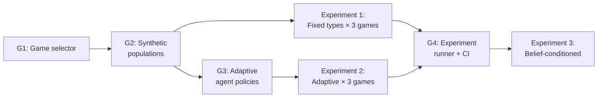

# ESL Experiment Feasibility Analysis

This document maps every experimental component from the NeurIPS paper (Section 5) against what the codebase currently supports, identifies gaps, and proposes a concrete experiment design.

---

## 1. Feasibility Matrix

### 1A. Stage Games

| Game | Paper says | Codebase status | What's needed |
|:---|:---|:---|:---|
| **Iterated Prisoner's Dilemma** | ✅ Required | ✅ **Exists** — [games.py:28](file:///home/batman/expts/esl/esl/games.py#L28), payoffs configurable via `pd_t/r/p/s` | Nothing |
| **Stag Hunt** | ✅ Required | ❌ **Missing** | Add `stag_hunt(cfg)` to [games.py](file:///home/batman/expts/esl/esl/games.py) + payoff fields to [config.py](file:///home/batman/expts/esl/esl/config.py) |
| **Matching Pennies** | ✅ Required | ❌ **Missing** | Add `matching_pennies(cfg)` to [games.py](file:///home/batman/expts/esl/esl/games.py) |

> [!NOTE]
> All three are 2×2 matrix games, so `num_actions=2` stays valid. Adding them is straightforward — just new payoff matrices. The `trainer.py` hardcodes `games.prisoners_dilemma(cfg)` at [line 318](file:///home/batman/expts/esl/esl/trainer.py#L318); this needs to become configurable (e.g., `cfg.game_type` field).

**Standard payoffs for the missing games:**

```
Stag Hunt:              Matching Pennies:
       S     H                  H     T
  S  (4,4)  (0,3)          H  (1,-1) (-1,1)
  H  (3,0)  (2,2)          T  (-1,1) (1,-1)
```

---

### 1B. Population Regimes

| Regime | Paper says | Codebase status | What's needed |
|:---|:---|:---|:---|
| **Fixed types** | Stationary policies | ✅ **Exists** — Recovery mode with `AlwaysCooperate`/`AlwaysDefect` | Extend with **stochastic softmax policies** (paper says agents have "stochastic deviations around prototypes" — this is exactly `SoftmaxLogitsPolicy` in [synthetic_population.py](file:///home/batman/expts/esl/esl/synthetic_population.py#L73)) |
| **Adaptive agents** | Independent online learning | ❌ **Missing** | Need new `HiddenPolicy` subclasses that update their own parameters (e.g., multiplicative weights, fictitious play, or Q-learning) |
| **Belief-conditioned** | Adapt based on internal models | 🟡 **Partial** — Adaptation mode exists but it uses ESL's OWN beliefs+prototypes as the policy | For baselines, need agents that maintain their own independent opponent models |

> [!WARNING]
> **The "Fixed types with stochastic deviations" regime (paper §5.1) is the most important and doable first.** The current code uses deterministic `AlwaysCooperate`/`AlwaysDefect`, but the paper says agents are drawn from θ★_k + noise. The module `synthetic_population.py` already has:
> - `sample_latent_types(rng, rho, N)` — categorical type assignment z_i ~ ρ
> - `sample_gaussian_parameter_noise(rng, N, A, σ)` — idiosyncratic noise φ_i
> - `agent_logits_from_star(θ★, z, φ)` — θ̃_i = θ★_{z_i} + φ_i
> - `SoftmaxLogitsPolicy(logits)` — stochastic policy from logits
> 
> **BUT:** `trainer.py` doesn't use any of this! It builds policies from `HIDDEN_POLICY_BUILDERS` (deterministic AC/AD). To use synthetic populations, the trainer needs a way to accept custom `HiddenPolicy` lists.

---

### 1C. Evaluation Metrics

| Metric | Paper says | Codebase status | Where |
|:---|:---|:---|:---|
| **MCE** (prototype recovery) | ✅ Required | ✅ **Exists** | [metrics.py:81](file:///home/batman/expts/esl/esl/metrics.py#L81) — `mce_value()` |
| **Belief CE** vs true types | ✅ Required | ✅ **Exists** | [metrics.py:96](file:///home/batman/expts/esl/esl/metrics.py#L96) — `belief_cross_entropy_vs_type()` |
| **Belief KL** vs true types | ✅ Required | ✅ **Exists** | [metrics.py:118](file:///home/batman/expts/esl/esl/metrics.py#L118) — `belief_kl_true_vs_belief()` |
| **Belief top-1 accuracy** | ✅ Required | ✅ **Exists** | [metrics.py:169](file:///home/batman/expts/esl/esl/metrics.py#L169) — `belief_argmax_accuracy()` |
| **Mean belief CE** vs types | ✅ Required | ✅ **Exists** | [metrics.py:137](file:///home/batman/expts/esl/esl/metrics.py#L137) — `mean_belief_ce_vs_types()` |
| **Average return** (task perf) | ✅ Required | 🟡 **Partial** — reward rows stored in `log.reward_rows`, cumulative social payoff in summary | Needs per-agent per-regime summary |
| **Win rate** vs held-out | ✅ Required | ❌ **Missing** | Need held-out evaluation loop (train on one population, test on another) |

> [!TIP]
> **Good news: metrics are 90% complete.** The main gap is structuring the experiment runner to compute them per-game, per-regime, and across seeds with confidence intervals.

---

### 1D. Baselines (from paper)

| Baseline | Feasibility | Effort |
|:---|:---|:---|
| **Independent PPO** | Outside scope — needs RL framework (Stable Baselines / CleanRL) | 🔴 High |
| **M-FOS** | Outside scope — opponent-shaping, needs differentiable game | 🔴 High |
| **MBOM** | Outside scope — model-based opponent modeling | 🔴 High |
| **Simple Opponent Model** | ✅ Doable — frequency-based prediction + best response | 🟢 Low |
| **FCM/GMM Clustering** | ✅ Doable — sklearn clustering on action statistics | 🟢 Low |

> [!IMPORTANT]
> For a feasible thesis/experiment set, I recommend **skipping PPO/M-FOS/MBOM** (they need separate RL codebases) and implementing only the **Simple Opponent Model** and **FCM/GMM Clustering** baselines. These are directly comparable to ESL in the same framework.

---

## 2. Gap Summary: What Needs to Be Built

### Must-have (blocking experiments)

| # | Component | Effort | Files to modify |
|:---|:---|:---|:---|
| **G1** | **Game selector** — add Stag Hunt + Matching Pennies payoffs, make game configurable | 🟢 Small | [games.py](file:///home/batman/expts/esl/esl/games.py), [config.py](file:///home/batman/expts/esl/esl/config.py), [trainer.py:318](file:///home/batman/expts/esl/esl/trainer.py#L318) |
| **G2** | **Synthetic population integration** — allow trainer to use `SoftmaxLogitsPolicy` from `synthetic_population.py` instead of deterministic AC/AD | 🟢 Small | [trainer.py](file:///home/batman/expts/esl/esl/trainer.py) (hidden_policies construction) |
| **G3** | **Adaptive agent policies** — implement at least one learning policy (e.g., Multiplicative Weights Update or EXP3) | 🟡 Medium | New class in [games.py](file:///home/batman/expts/esl/esl/games.py) |
| **G4** | **Experiment runner** — sweep over (game × regime × seeds), collect metrics, compute mean ± 95% CI | 🟡 Medium | New file in `esl/experiments/` |

### Nice-to-have (strengthen results)

| # | Component | Effort |
|:---|:---|:---|
| **G5** | Simple Opponent Model baseline | 🟢 Small |
| **G6** | GMM clustering baseline | 🟢 Small |
| **G7** | Held-out evaluation (train on pop A, test on pop B) | 🟡 Medium |

---

## 3. Do These Experiments Make Sense?

**Yes, and here's why they're well-designed for validating ESL:**

### Fixed types (Recovery)
- **Purpose:** Does ESL recover the ground-truth latent structure when opponents don't change?
- **Why it works:** This is the simplest case. If ESL can't recover prototypes here, it fails everywhere.
- **What it validates:** The Bayesian belief update + prototype SGD loop converges to θ★.
- **Key metric:** MCE ↓ and belief accuracy ↑ over time.

### Adaptive agents
- **Purpose:** Does ESL handle non-stationarity? Real opponents learn and change behavior.
- **Why it's harder:** The data distribution shifts because opponents update their policies. ESL's theoretical analysis assumes a controlled Markov noise process — adaptive opponents test whether that assumption holds approximately in practice.
- **What it validates:** Robustness of the two-timescale separation.
- **Key metric:** Task performance (return) vs baselines that don't model opponents.

### Belief-conditioned agents
- **Purpose:** The hardest regime — opponents adapt based on what they think ESL is doing.
- **Why it's important:** This is the endogenous coupling the paper talks about. It tests whether ESL's differential inclusion characterization holds when everyone is simultaneously learning.
- **What it validates:** Strategic stability of the learned representations.

### Three games
- **IPD:** Cooperation under temptation → tests whether ESL identifies cooperators vs defectors.
- **Stag Hunt:** Coordination → tests whether ESL distinguishes risk-averse (Hare) from risk-seeking (Stag) agents.
- **Matching Pennies:** Zero-sum → tests whether ESL handles adversarial structure where static prototypes may not exist.

---

## 4. Proposed Experiment Design

### Experiment Grid

```
Games:   {IPD, Stag Hunt, Matching Pennies}
Regimes: {Fixed, Adaptive, Belief-conditioned}
K:       {2, 3}  (number of prototypes)
N:       20 agents
Seeds:   5 random seeds per configuration
Rounds:  10,000 (with convergence stopping)
```

**Total configurations: 3 × 3 × 2 × 5 = 90 runs**

### Per-Game Ground-Truth Prototypes (θ★)

| Game | K=2 prototypes | K=3 prototypes |
|:---|:---|:---|
| **IPD** | θ★₀ = [2, 0] (cooperator), θ★₁ = [0, 2] (defector) | + θ★₂ = [0, 0] (mixed/random) |
| **Stag Hunt** | θ★₀ = [2, 0] (stag-hunter), θ★₁ = [0, 2] (hare-player) | + θ★₂ = [1, 1] (mixed coordinator) |
| **Matching Pennies** | θ★₀ = [1, -1] (heads-biased), θ★₁ = [-1, 1] (tails-biased) | + θ★₂ = [0, 0] (uniform) |

### Population Generation (per run)

Using `synthetic_population.py`:
```python
θ_star = np.array([[2, 0], [0, 2]])            # K ground-truth prototypes
rho = np.ones(K) / K                            # uniform type prior
z = sample_latent_types(rng, rho, N=20)          # categorical assignment
phi = sample_gaussian_parameter_noise(rng, N, A=2, sigma=0.3)  # noise
agent_logits = agent_logits_from_star(θ_star, z, phi)
policies = build_softmax_policies(agent_logits)  # stochastic hidden policies
```

### Metrics to Report (per run)

| Metric | Computation | Already exists? |
|:---|:---|:---|
| **Final MCE** | `mce_value(true_type_probs, logits)` | ✅ |
| **MCE trajectory** | Per-round MCE from `log.summary_rows` | ✅ |
| **Belief accuracy** | `belief_argmax_accuracy(beliefs, true_types, perm, N)` | ✅ |
| **Belief CE** | `mean_belief_ce_vs_types(beliefs, true_types, N, K)` | ✅ |
| **Average return** | `sum(r_i + r_j) / (2 * num_interactions)` from `log.reward_rows` | ✅ (in summary) |
| **Convergence round** | `summary_out["convergence_round"]` | ✅ |

### Reporting

Per configuration (game × regime × K): **mean ± 95% CI across 5 seeds** — exactly as the paper says.

---

## 5. Recommended Build Order



| Priority | Task | Est. effort | Unblocks |
|:---|:---|:---|:---|
| **P0** | G1: Add Stag Hunt + Matching Pennies + game selector | ~1 hour | All experiments |
| **P1** | G2: Wire synthetic population into trainer | ~1 hour | Fixed-type experiments with proper stochastic agents |
| **P2** | G4: Experiment runner with seed sweeps + CI | ~2 hours | All reporting |
| **P3** | G3: Adaptive agent (MWU or EXP3) | ~2 hours | Adaptive regime experiments |
| **P4** | Run Experiment 1 (Fixed × 3 games) | ~1 hour | First results |

> [!IMPORTANT]
> **Start with G1 + G2 + the Fixed-type regime.** This gets you publishable results on the easiest axis (prototype recovery) across all three games with minimal code changes. The adaptive and belief-conditioned regimes can follow once the pipeline is working.
